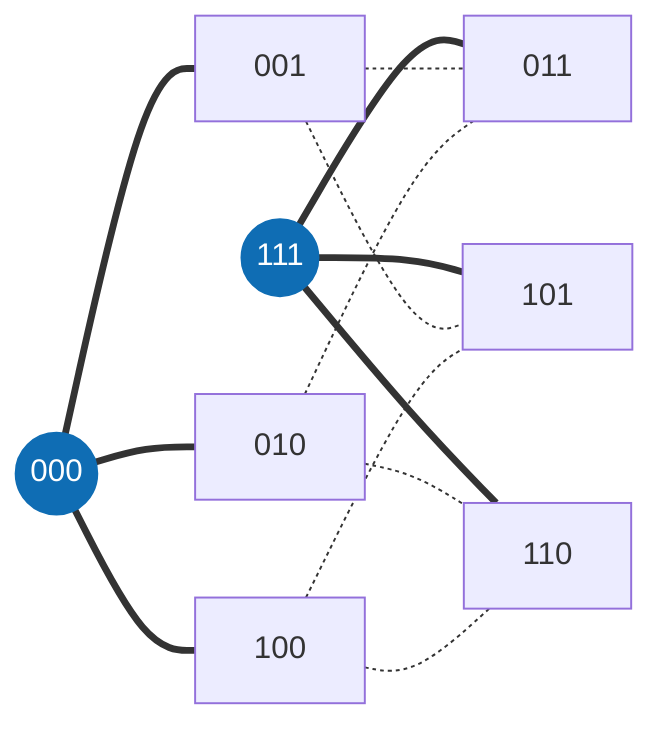

<div align="center">

[English](README.md) · [Português](README.pt-BR.md) · **Français**

<picture>
  <source media="(prefers-color-scheme: dark)" srcset="docs/assets/banner-escuro.png">
  <source media="(prefers-color-scheme: light)" srcset="docs/assets/banner-claro.png">
  
</picture>

# Matemática

**Découverte coûteuse, vérification bon marché : des bornes de codes de recouvrement vérifiées par un évaluateur exact et par le noyau de Lean.**

[](https://github.com/thiagopatzdorf/Matematica/actions/workflows/ci.yml)
[](https://github.com/thiagopatzdorf/Matematica/actions/workflows/verify-codes.yml)
[](https://doi.org/10.5281/zenodo.23085769)
[](https://lean-lang.org)
[](LICENSE)

[Site](https://genesisinnovation.io/matematica) ·
[Résultats](docs/resultados.md) ·
[Philosophie](docs/PHILOSOPHIE.md) ·
[Documentation](docs/README.md) ·
[Note](paper/main.pdf)

</div>

---

## Le problème en une image

Imaginez une ville où chaque maison a une adresse de `n` lettres, et où la distance entre deux maisons est le nombre
de lettres à changer pour passer d'une adresse à l'autre. Une tour atteint toutes les maisons à au plus `R`
changements. **Quel est le plus petit nombre de tours qui couvre toute la ville ?** Ce nombre est `K_q(n,R)`.

Dans le plus petit cas intéressant, les adresses sont les 8 mots de 3 bits et chaque tour atteint un changement.
Deux tours, en `000` et `111`, suffisent : tout autre mot est à un bit de l'une d'elles. Une seule tour ne couvre que
4 maisons, donc `K_2(3,1) = 2`.



Toute réponse a deux côtés. Une **borne supérieure** montre des tours qui suffisent : les trouver est difficile, mais
vérifier, c'est compter. Une **borne inférieure** prouve qu'un nombre plus petit est impossible, et c'est le côté
difficile, car il faut écarter toutes les alternatives. Expliqué en quatre niveaux (30 secondes, lycée, licence,
recherche) dans [docs/EXPLIQUE.md](docs/EXPLIQUE.md) ; le pourquoi de la méthode, dans
[docs/PHILOSOPHIE.md](docs/PHILOSOPHIE.md).

## I. Définition

Un **code de recouvrement** est un ensemble de mots de longueur `n` sur `q` symboles tel que tout mot de l'espace se
trouve à distance de Hamming au plus `R` de l'un d'eux. `K_q(n,R)` est la taille du plus petit code de ce type :

$$K_q(n,R) \;=\; \min\bigl\{\,|C| \;:\; C \subseteq \mathbb{Z}_q^n,\ \ \forall x \in \mathbb{Z}_q^n\ \ \exists c \in C,\ \ d_H(x,c) \le R \,\bigr\}$$

Une borne supérieure est un code explicite : le trouver est difficile, le vérifier, c'est compter. La référence est
constituée par les [tables de Kéri](https://old.sztaki.hu/~keri/codes/) ; tout le vocabulaire est dans le
[glossaire](docs/GLOSSARIO.md) (en portugais).

## II. Principes

1. **Seul compte ce que la machine vérifie.** Une preuve est un évaluateur déterministe ou le noyau de Lean. L'avis d'un modèle, ou d'une personne, n'est pas une preuve.
2. **Une vérification bon marché vaut mieux qu'une découverte coûteuse.** La recherche peut être chère et faillible ; ce qui reste dans le dépôt est le certificat qui se vérifie en quelques secondes.
3. **Toute erreur devient une règle.** Un défaut trouvé devient un test qui échoue, pas un pense-bête.
4. **Tout est réversible.** Chaque état se reconstruit à partir du dépôt : codes, certificats, registre et preuves.

Le pourquoi de chacun est dans [docs/PHILOSOPHIE.md](docs/PHILOSOPHIE.md).

## III. Propositions

A machine-checked ledger of covering-code upper bounds, with formally certified exact entries.
Le bloc ci-dessous est généré à partir de `ledger/cells.json` et ne se modifie pas à la main.

<!-- RESULTADOS:INICIO -->
<!-- Généré par tools/site/gerar_resultados.py à partir de ledger/cells.json ; ne pas modifier à la main. -->

> A machine-checked ledger of covering-code upper bounds, with formally certified exact entries.

| quoi | valeur |
|---|---:|
| cellules `K_q(n,R)` dans le registre (q de 2 à 21) | **1145** |
| exactes (borne inférieure = borne supérieure) | **523** |
| ouvertes | **622** |
| bornes supérieures qui sont des théorèmes du noyau de Lean (FORMALIZED + INDEPENDENTLY_REPRODUCED) | **547** sur 1145 (481 + 66) |
| bornes inférieures par état (presque toutes héritées de la littérature) | CLAIMED 1140 · CERTIFICATE_VERIFIED 3 · FORMALIZED 2 |
| valeurs exactes établies ici (l'intervalle publié était ouvert) | **4** (1 avec les deux bornes dans le noyau ; 3 avec la borne inférieure par certificat vérifié hors de Lean) |
| cellules avec un théorème Lean à nous | **15** (12 sous la meilleure borne supérieure publiée que nous avons trouvée) |
| codes explicites dans `data/codes/` | **19** (tous passent le vérificateur C officiel, `tools/verify/check_all.sh`, en CI) ; 13 sont le témoin actuel d'une borne du registre, sha256 vérifié |

Version 0.9.1 · DOI [10.5281/zenodo.23085769](https://doi.org/10.5281/zenodo.23085769) · registre mis à jour le 2026-10-06. Les bornes inférieures ne sont **pas**, en général, dans Lean : seules 2 d'entre elles sont des théorèmes du noyau.

### Faits marquants

Cellules avec un résultat à nous : théorème Lean ou borne inférieure par certificat vérifié. Nouvelles valeurs exactes d'abord ; ensuite, plus grand gain relatif sur la borne supérieure.

| cellule | avant (publié) | maintenant | état inférieur | état supérieur | preuve |
|---|---:|---:|---|---|---|
| `K_7(6,4)` | 13–15 | **= 14** | CERTIFICATE_VERIFIED | INDEPENDENTLY_REPRODUCED | [FIBRAS_GERAL](docs/exatos/FIBRAS_GERAL.md) · `CoveringK764.K_7_6_4_le_14` · [code](data/codes/q7_n6_R4_M14.txt) |
| `K_3(6,2)` | 15–17 | **= 17** | CERTIFICATE_VERIFIED | INDEPENDENTLY_REPRODUCED | [K3_M16](docs/exatos/k362/K3_M16.md) · `CoveringLedger.K3_6_2_le_17` |
| `K_7(5,3)` | 15–17 | **= 17** | CERTIFICATE_VERIFIED | INDEPENDENTLY_REPRODUCED | [FIBRAS_GERAL](docs/exatos/FIBRAS_GERAL.md) · `CoveringK753.K_7_5_3_le_17` · [code](data/codes/q7_n5_R3_M17.txt) |
| `K_7(4,2)` | 17–19 | **= 19** | FORMALIZED | FORMALIZED | [FASE1_B_K742](docs/exatos/FASE1_B_K742.md) · `K742.K_7_4_2_le_19` · `K742.K_7_4_2_eq_19` |
| `K_5(10,4)` | 177–875 | 177–**625** (−28,6 %) | CLAIMED | INDEPENDENTLY_REPRODUCED | `CoveringKernel.K5_10_4_le_625_kernel` · [code](data/codes/q5_n10_R4_M625.txt) |
| `K_7(9,4)` | 264–1475 | 264–**1134** (−23,1 %) | CLAIMED | INDEPENDENTLY_REPRODUCED | `Syn.K7_9_4_le_1134_syn` · [code](data/codes/q7_n9_R4_M1134.txt) |
| `K_7(8,3)` | 471–2337 | 471–**1887** (−19,3 %) | CLAIMED | INDEPENDENTLY_REPRODUCED | `Syn.K7_8_3_le_1887_syn` · [code](data/codes/q7_n8_R3_M1887.txt) |
| `K_7(10,4)` | 1007–6517 | 1007–**5607** (−14,0 %) | CLAIMED | INDEPENDENTLY_REPRODUCED | `Syn.K7_10_4_le_5607_syn` · [code](data/codes/q7_n10_R4_M5607.txt) |
| `K_5(9,5)` | 19–55 | 19–**50** (−9,1 %) | CLAIMED | INDEPENDENTLY_REPRODUCED | `CoveringKernel.K5_9_5_le_50_kernel` · [code](data/codes/q5_n9_R5_M50.txt) |
| `K_5(11,4)` | 546–3125 | 546–**2875** (−8,0 %) | CLAIMED | INDEPENDENTLY_REPRODUCED | `Syn.K5_11_4_le_2875_syn` · [code](data/codes/q5_n11_R4_M2875.txt) |
| `K_4(10,4)` | 62–208 | 62–**192** (−7,7 %) | CLAIMED | INDEPENDENTLY_REPRODUCED | `CoveringKernel.K4_10_4_le_192_kernel` · [code](data/codes/q4_n10_R4_M192.txt) |
| `K_5(10,5)` | 41–175 | 41–**162** (−7,4 %) | CLAIMED | INDEPENDENTLY_REPRODUCED | `Syn.K5_10_5_le_162_syn` · [code](data/codes/q5_n10_R5_M162.txt) |
| `K_5(7,2)` | 236–525 | 236–**500** (−4,8 %) | CLAIMED | INDEPENDENTLY_REPRODUCED | `CoveringKernel.K5_7_2_le_500_kernel` · [code](data/codes/q5_n7_R2_M500.txt) |
| `K_5(9,3)` | 354–1275 | 354–**1250** (−2,0 %) | CLAIMED | INDEPENDENTLY_REPRODUCED | `CoveringKernel.K5_9_3_le_1250_kernel` · [code](data/codes/q5_n9_R3_M1250.txt) |
| `K_5(9,4)` | 64–255 | 64–**250** (−2,0 %) | CLAIMED | INDEPENDENTLY_REPRODUCED | `CoveringKernel.K5_9_4_le_250_kernel` · [code](data/codes/q5_n9_R4_M250.txt) |
| `K_2(6,1)` | = 12 | **= 12** | FORMALIZED | FORMALIZED | `SC.K_2_6_1_eq12` |

Potentiellement nouvelles (introuvables dans la littérature consultée, voir [NOVIDADE_V09](docs/exatos/NOVIDADE_V09.md)) : `K_7(6,4)`, `K_3(6,2)`, `K_7(5,3)`.

Lacunes déclarées : la borne inférieure de `K_7(6,4)`, `K_3(6,2)`, `K_7(5,3)` est un certificat calculatoire vérifié, pas un théorème Lean.
<!-- RESULTADOS:FIM -->

## IV. Démonstration

Chaque borne gravit une échelle d'états, et chaque échelon exige une vérification plus forte que le précédent :

<p align="center">
  
</p>

| état | ce qui a été vérifié |
|---|---|
| `CLAIMED` | figure dans une source publiée ; rien n'a été vérifié ici |
| `WITNESS_CHECKED` | un vérificateur exact, hors de Lean, a accepté le certificat |
| `CERTIFICATE_VERIFIED` | bornes inférieures seulement : certificats LRAT, VeriPB ou Farkas fixés par sha256, vérifiés par un vérificateur indépendant du générateur, avec red team |
| `FORMALIZED` | il existe un théorème Lean, vérifié par le noyau, sans hypothèse en suspens |
| `INDEPENDENTLY_REPRODUCED` | formalisé **et** vérifié par un second vérificateur, effectivement exécuté |

La définition complète de chaque échelon est dans [ledger/README.md](ledger/README.md) ; le décompte par état, dans
[ledger/COBERTURA.md](ledger/COBERTURA.md). Reproduire demande trois commandes (il faut `cc`, Python 3 et
[elan](https://lean-lang.org/install/)) :

```bash
git clone https://github.com/thiagopatzdorf/Matematica && cd Matematica
tools/verify/check_all.sh          # chaque code de data/codes/ dans le vérificateur officiel en C
lake exe cache get && lake build   # les preuves dans le noyau de Lean
```

## V. Méthode

<p align="center">
  
</p>

La méthode est un effondrement : de nombreux candidats (recherche, SAT, constructions algébriques, agents) entrent,
un évaluateur exact tranche, et ce qui reste est une structure vérifiable. Le pipeline réel, fichier par fichier, est
dans [docs/ARQUITETURA.md](docs/ARQUITETURA.md) (en portugais) ; la version visuelle, sur
[genesisinnovation.io/matematica](https://genesisinnovation.io/matematica).

## VI. Horizon

Le même principe sous-tend le [théorème de James](https://github.com/thiagopatzdorf/james-theorems), où découvrir
coûte cher et vérifier coûte peu. Les [problèmes du prix du millénaire](https://www.claymath.org/millennium-problems/)
sont l'inspiration à long terme de la méthode, non quelque chose que ce dépôt résout ou attaque.

## VII. Contribuer · Citer · Licence

**Contribuer.** Choisissez une cellule avec `python3 ledger/targets.py --top 10`, ouvrez une issue indiquant celle
que vous attaquez et suivez [CONTRIBUTING.md](CONTRIBUTING.md). Les agents commencent par [AGENTS.md](AGENTS.md) et
le [MCP Infinito](infinito/README.md).

**Citer.** DOI de concept [10.5281/zenodo.23085769](https://doi.org/10.5281/zenodo.23085769), qui pointe toujours
vers la version la plus récente. Les métadonnées sont dans `CITATION.cff`, et GitHub propose le bouton
« Cite this repository ».

**Licence.** [CC BY 4.0](LICENSE). Conduite : [CODE_OF_CONDUCT.md](CODE_OF_CONDUCT.md). Sécurité : [SECURITY.md](SECURITY.md).
