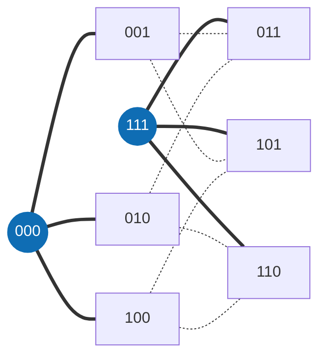

<div align="center">

[English](README.md) · [Português](README.pt-BR.md) · **Français**

<picture>
  <source media="(prefers-color-scheme: dark)" srcset="docs/assets/banner-escuro.svg">
  <source media="(prefers-color-scheme: light)" srcset="docs/assets/banner-claro.svg">
  
</picture>

# Matemática

**Découverte coûteuse, vérification bon marché : des bornes de codes de recouvrement vérifiées par un évaluateur exact et par le noyau de Lean.**

[](https://github.com/thiagopatzdorf/Matematica/actions/workflows/ci.yml)
[](https://github.com/thiagopatzdorf/Matematica/actions/workflows/verify-codes.yml)
[](https://doi.org/10.5281/zenodo.23085769)
[](https://lean-lang.org)
[](LICENSE)

[Site](https://genesisinnovation.io/matematica) ·
[Résultats](docs/resultados.md) ·
[Philosophie](docs/PHILOSOPHIE.md) ·
[Documentation](docs/README.md) ·
[Note](paper/main.pdf)

</div>

---

## Le problème en une image

Imaginez une ville où chaque maison a une adresse de `n` lettres, et où la distance entre deux maisons est le nombre
de lettres à changer pour passer d'une adresse à l'autre. Une tour atteint toutes les maisons à au plus `R`
changements. **Quel est le plus petit nombre de tours qui couvre toute la ville ?** Ce nombre est `K_q(n,R)`.

Dans le plus petit cas intéressant, les adresses sont les 8 mots de 3 bits et chaque tour atteint un changement.
Deux tours, en `000` et `111`, suffisent : tout autre mot est à un bit de l'une d'elles. Une seule tour ne couvre que
4 maisons, donc `K_2(3,1) = 2`.



Toute réponse a deux côtés. Une **borne supérieure** montre des tours qui suffisent : les trouver est difficile, mais
vérifier, c'est compter. Une **borne inférieure** prouve qu'un nombre plus petit est impossible, et c'est le côté
difficile, car il faut écarter toutes les alternatives. Expliqué en quatre niveaux (30 secondes, lycée, licence,
recherche) dans [docs/EXPLIQUE.md](docs/EXPLIQUE.md) ; le pourquoi de la méthode, dans
[docs/PHILOSOPHIE.md](docs/PHILOSOPHIE.md).

## I. Définition

Un **code de recouvrement** est un ensemble de mots de longueur `n` sur `q` symboles tel que tout mot de l'espace se
trouve à distance de Hamming au plus `R` de l'un d'eux. `K_q(n,R)` est la taille du plus petit code de ce type :

$$K_q(n,R) \;=\; \min\bigl\{\,|C| \;:\; C \subseteq \mathbb{Z}_q^n,\ \ \forall x \in \mathbb{Z}_q^n\ \ \exists c \in C,\ \ d_H(x,c) \le R \,\bigr\}$$

Une borne supérieure est un code explicite : le trouver est difficile, le vérifier, c'est compter. La référence est
constituée par les [tables de Kéri](https://old.sztaki.hu/~keri/codes/) ; tout le vocabulaire est dans le
[glossaire](docs/GLOSSARIO.md) (en portugais).

## II. Principes

1. **Seul compte ce que la machine vérifie.** Une preuve est un évaluateur déterministe ou le noyau de Lean. L'avis d'un modèle, ou d'une personne, n'est pas une preuve.
2. **Une vérification bon marché vaut mieux qu'une découverte coûteuse.** La recherche peut être chère et faillible ; ce qui reste dans le dépôt est le certificat qui se vérifie en quelques secondes.
3. **Toute erreur devient une règle.** Un défaut trouvé devient un test qui échoue, pas un pense-bête.
4. **Tout est réversible.** Chaque état se reconstruit à partir du dépôt : codes, certificats, registre et preuves.

Le pourquoi de chacun est dans [docs/PHILOSOPHIE.md](docs/PHILOSOPHIE.md).

## III. Propositions

A machine-checked ledger of covering-code upper bounds, with formally certified exact entries.
Le bloc ci-dessous est généré à partir de `ledger/cells.json` et ne se modifie pas à la main.

<!-- RESULTADOS:INICIO -->
<!-- RESULTADOS:FIM -->

## IV. Démonstration

Chaque borne gravit une échelle d'états, et chaque échelon exige une vérification plus forte que le précédent :

<p align="center">
  
</p>

| état | ce qui a été vérifié |
|---|---|
| `CLAIMED` | figure dans une source publiée ; rien n'a été vérifié ici |
| `WITNESS_CHECKED` | un vérificateur exact, hors de Lean, a accepté le certificat |
| `CERTIFICATE_VERIFIED` | bornes inférieures seulement : certificats LRAT, VeriPB ou Farkas fixés par sha256, vérifiés par un vérificateur indépendant du générateur, avec red team |
| `FORMALIZED` | il existe un théorème Lean, vérifié par le noyau, sans hypothèse en suspens |
| `INDEPENDENTLY_REPRODUCED` | formalisé **et** vérifié par un second vérificateur, effectivement exécuté |

La définition complète de chaque échelon est dans [ledger/README.md](ledger/README.md) ; le décompte par état, dans
[ledger/COBERTURA.md](ledger/COBERTURA.md). Reproduire demande trois commandes (il faut `cc`, Python 3 et
[elan](https://lean-lang.org/install/)) :

```bash
git clone https://github.com/thiagopatzdorf/Matematica && cd Matematica
tools/verify/check_all.sh          # chaque code de data/codes/ dans le vérificateur officiel en C
lake exe cache get && lake build   # les preuves dans le noyau de Lean
```

## V. Méthode

<p align="center">
  
</p>

La méthode est un effondrement : de nombreux candidats (recherche, SAT, constructions algébriques, agents) entrent,
un évaluateur exact tranche, et ce qui reste est une structure vérifiable. Le pipeline réel, fichier par fichier, est
dans [docs/ARQUITETURA.md](docs/ARQUITETURA.md) (en portugais) ; la version visuelle, sur
[genesisinnovation.io/matematica](https://genesisinnovation.io/matematica).

## VI. Horizon

Le même principe sous-tend le [théorème de James](https://github.com/thiagopatzdorf/james-theorems), où découvrir
coûte cher et vérifier coûte peu. Les [problèmes du prix du millénaire](https://www.claymath.org/millennium-problems/)
sont l'inspiration à long terme de la méthode, non quelque chose que ce dépôt résout ou attaque.

## VII. Contribuer · Citer · Licence

**Contribuer.** Choisissez une cellule avec `python3 ledger/targets.py --top 10`, ouvrez une issue indiquant celle
que vous attaquez et suivez [CONTRIBUTING.md](CONTRIBUTING.md). Les agents commencent par [AGENTS.md](AGENTS.md) et
le [MCP Infinito](infinito/README.md).

**Citer.** DOI de concept [10.5281/zenodo.23085769](https://doi.org/10.5281/zenodo.23085769), qui pointe toujours
vers la version la plus récente. Les métadonnées sont dans `CITATION.cff`, et GitHub propose le bouton
« Cite this repository ».

**Licence.** [CC BY 4.0](LICENSE). Conduite : [CODE_OF_CONDUCT.md](CODE_OF_CONDUCT.md). Sécurité : [SECURITY.md](SECURITY.md).
