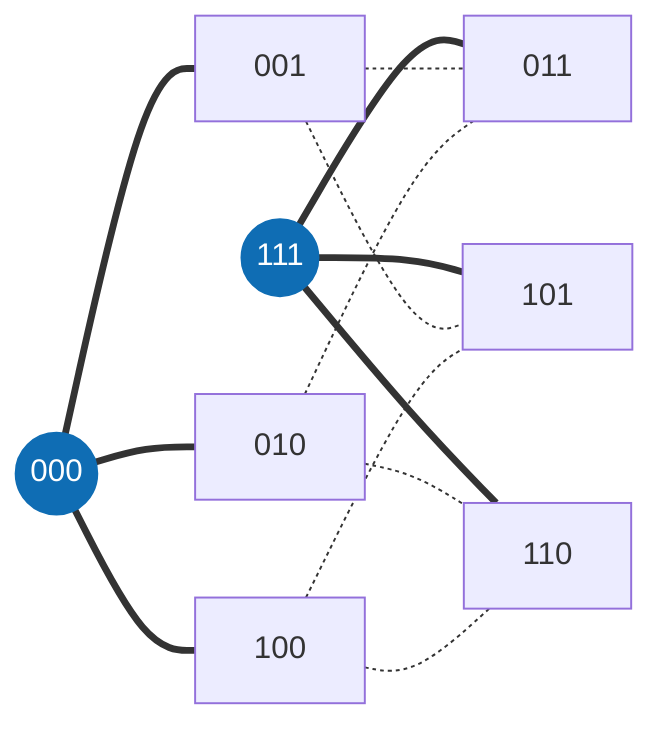

<div align="center">

**English** · [Português](README.pt-BR.md) · [Français](README.fr.md)

<picture>
  <source media="(prefers-color-scheme: dark)" srcset="docs/assets/banner-escuro.svg">
  <source media="(prefers-color-scheme: light)" srcset="docs/assets/banner-claro.svg">
  
</picture>

# Matemática

**Expensive discovery, cheap verification: covering-code bounds checked by an exact evaluator and by the Lean kernel.**

[](https://github.com/thiagopatzdorf/Matematica/actions/workflows/ci.yml)
[](https://github.com/thiagopatzdorf/Matematica/actions/workflows/verify-codes.yml)
[](https://doi.org/10.5281/zenodo.23085769)
[](https://lean-lang.org)
[](LICENSE)

[Website](https://genesisinnovation.io/matematica) ·
[Results](docs/resultados.md) ·
[Philosophy](docs/PHILOSOPHY.md) ·
[Documentation](docs/README.md) ·
[Note](paper/main.pdf)

</div>

---

## The problem in one picture

Picture a town where every house has an address of `n` letters, and the distance between two houses is how many
letters you must change to get from one address to the other. A tower reaches every house within `R` changes.
**What is the smallest number of towers that covers the whole town?** That number is `K_q(n,R)`.

In the smallest interesting case, the addresses are the 8 words of 3 bits and each tower reaches one change. Two
towers, at `000` and `111`, are enough: every other word is one bit away from one of them. A single tower covers
only 4 houses, so `K_2(3,1) = 2`.



Every answer has two sides. An **upper bound** shows towers that suffice: finding them is hard, but checking is just
counting. A **lower bound** proves that fewer towers is impossible, and that is the hard side, because every
alternative must be ruled out. Explained in four layers (30 seconds, high school, undergraduate, research) in
[docs/EXPLAINED.md](docs/EXPLAINED.md); why the method works, in [docs/PHILOSOPHY.md](docs/PHILOSOPHY.md).

## I. Definition

A **covering code** is a set of words of length `n` over `q` symbols such that every word of the space lies within
Hamming distance `R` of one of them. `K_q(n,R)` is the size of the smallest such code:

$$K_q(n,R) \;=\; \min\bigl\{\,|C| \;:\; C \subseteq \mathbb{Z}_q^n,\ \ \forall x \in \mathbb{Z}_q^n\ \ \exists c \in C,\ \ d_H(x,c) \le R \,\bigr\}$$

An upper bound is an explicit code: finding it is hard, checking it is counting. The reference is
[Kéri's tables](https://old.sztaki.hu/~keri/codes/); the full vocabulary is in the [glossary](docs/GLOSSARIO.md) (Portuguese).

## II. Principles

1. **Only what the machine checks counts.** A proof is a deterministic evaluator or the Lean kernel. A model's opinion, or a person's, is not a proof.
2. **Cheap verification beats expensive discovery.** Search may be costly and fallible; what stays in the repository is the certificate that checks in seconds.
3. **Every error becomes a rule.** A defect found becomes a failing test, not a reminder.
4. **Everything is reversible.** Every state can be rebuilt from the repository: codes, certificates, ledger and proofs.

The reasoning behind each one is in [docs/PHILOSOPHY.md](docs/PHILOSOPHY.md).

## III. Propositions

A machine-checked ledger of covering-code upper bounds, with formally certified exact entries.
The block below is generated from `ledger/cells.json` and is not edited by hand.

<!-- RESULTADOS:INICIO -->
<!-- RESULTADOS:FIM -->

## IV. Demonstration

Every bound climbs a ladder of states, and each rung demands a stronger check than the one before:

<p align="center">
  
</p>

| state | what was checked |
|---|---|
| `CLAIMED` | it appears in a published source; nothing was checked here |
| `WITNESS_CHECKED` | an exact verifier, outside Lean, accepted the certificate |
| `CERTIFICATE_VERIFIED` | lower bounds only: LRAT, VeriPB or Farkas certificates pinned by sha256, checked by a verifier independent of the generator, with a red team |
| `FORMALIZED` | there is a Lean theorem, checked by the kernel, with no pending hypothesis |
| `INDEPENDENTLY_REPRODUCED` | formalized **and** checked by a second verifier, actually run |

The full definition of each rung is in [ledger/README.md](ledger/README.md); the count per state, in
[ledger/COBERTURA.md](ledger/COBERTURA.md). Reproducing takes three commands (needs `cc`, Python 3 and
[elan](https://lean-lang.org/install/)):

```bash
git clone https://github.com/thiagopatzdorf/Matematica && cd Matematica
tools/verify/check_all.sh          # every code in data/codes/ through the official C verifier
lake exe cache get && lake build   # the proofs in the Lean kernel
```

## V. Method

<p align="center">
  
</p>

The method is a collapse: many candidates (search, SAT, algebraic constructions, agents) go in, an exact evaluator
decides, and what remains is checkable structure. The real pipeline, file by file, is in
[docs/ARQUITETURA.md](docs/ARQUITETURA.md) (Portuguese); the visual version, at
[genesisinnovation.io/matematica](https://genesisinnovation.io/matematica).

## VI. Horizon

The same principle underlies [James's theorem](https://github.com/thiagopatzdorf/james-theorems), where discovering
is expensive and verifying is cheap. The [Millennium Prize Problems](https://www.claymath.org/millennium-problems/)
are the long-term inspiration for the method, not something this repository solves or attacks.

## VII. Contribute · Cite · License

**Contribute.** Pick a cell with `python3 ledger/targets.py --top 10`, open an issue saying which one you are working
on and follow [CONTRIBUTING.md](CONTRIBUTING.md). Agents start with [AGENTS.md](AGENTS.md) and the
[Infinito MCP](infinito/README.md).

**Cite.** Concept DOI [10.5281/zenodo.23085769](https://doi.org/10.5281/zenodo.23085769), which always resolves to
the latest version. Metadata is in `CITATION.cff`, and GitHub offers the "Cite this repository" button.

**License.** [CC BY 4.0](LICENSE). Conduct: [CODE_OF_CONDUCT.md](CODE_OF_CONDUCT.md). Security: [SECURITY.md](SECURITY.md).
