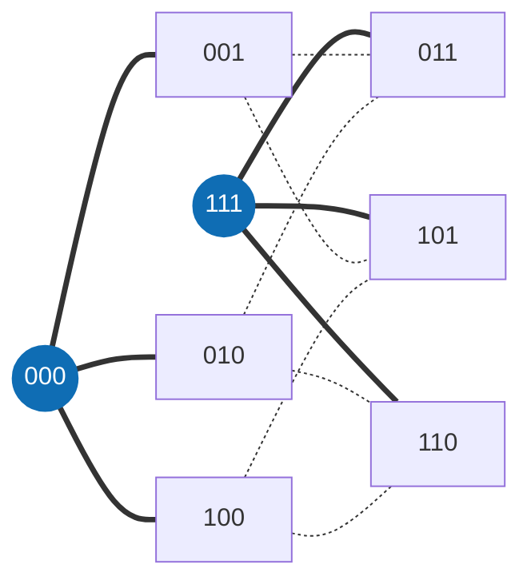

<div align="center">

[English](README.md) · **Português** · [Français](README.fr.md)

<picture>
  <source media="(prefers-color-scheme: dark)" srcset="docs/assets/banner-escuro.svg">
  <source media="(prefers-color-scheme: light)" srcset="docs/assets/banner-claro.svg">
  
</picture>

# Matemática

**Descoberta cara, verificação barata: cotas de códigos de cobertura que um avaliador exato e o kernel do Lean conferem.**

[](https://github.com/thiagopatzdorf/Matematica/actions/workflows/ci.yml)
[](https://github.com/thiagopatzdorf/Matematica/actions/workflows/verify-codes.yml)
[](https://doi.org/10.5281/zenodo.23085769)
[](https://lean-lang.org)
[](LICENSE)

[Página](https://genesisinnovation.io/matematica) ·
[Resultados](docs/resultados.md) ·
[Filosofia](docs/FILOSOFIA.md) ·
[Documentação](docs/README.md) ·
[Nota](paper/main.pdf)

</div>

---

## O problema em uma imagem

Imagine uma cidade onde cada casa tem um endereço de `n` letras, e a distância entre duas casas é quantas letras
é preciso trocar para ir de um endereço ao outro. Uma torre alcança todas as casas a até `R` trocas. **Qual é o
menor número de torres que cobre a cidade inteira?** Esse número é `K_q(n,R)`.

No menor exemplo interessante, os endereços são as 8 palavras de 3 bits e cada torre alcança uma troca. Duas
torres, em `000` e `111`, bastam: toda outra palavra está a um bit de uma delas. Uma torre só cobre 4 casas, então
`K_2(3,1) = 2`.



Toda resposta tem dois lados. A **cota superior** é mostrar torres que bastam: achar é difícil, mas conferir é só
contar. A **cota inferior** é provar que menos torres é impossível, e esse é o lado difícil, porque é preciso
descartar todas as alternativas. Explicado em quatro camadas (30 segundos, ensino médio, graduação, pesquisa) em
[docs/EXPLICANDO.md](docs/EXPLICANDO.md); o porquê do método, em [docs/FILOSOFIA.md](docs/FILOSOFIA.md).

## I. Definição

Um **código de cobertura** é um conjunto de palavras de comprimento `n` sobre `q` símbolos tal que toda palavra do
espaço fica a distância de Hamming no máximo `R` de alguma delas. `K_q(n,R)` é o tamanho do menor código assim:

$$K_q(n,R) \;=\; \min\bigl\{\,|C| \;:\; C \subseteq \mathbb{Z}_q^n,\ \ \forall x \in \mathbb{Z}_q^n\ \ \exists c \in C,\ \ d_H(x,c) \le R \,\bigr\}$$

Uma cota superior é um código explícito: achar é difícil, conferir é contar. A referência são as
[tabelas do Kéri](https://old.sztaki.hu/~keri/codes/); o vocabulário inteiro está no [glossário](docs/GLOSSARIO.md).

## II. Princípios

1. **Só conta o que a máquina confere.** Prova é um avaliador determinístico ou o kernel do Lean. Opinião de modelo, ou de gente, não é prova.
2. **Verificação barata vale mais que descoberta cara.** A busca pode ser cara e falível; o que fica no repositório é o certificado que se confere em segundos.
3. **Todo erro vira regra.** Um defeito achado vira teste que falha, não lembrete.
4. **Tudo é reversível.** Cada estado é reconstruível a partir do repositório: códigos, certificados, ledger e provas.

O porquê de cada um está em [docs/FILOSOFIA.md](docs/FILOSOFIA.md).

## III. Proposições

A machine-checked ledger of covering-code upper bounds, with formally certified exact entries.
O bloco abaixo é gerado a partir de `ledger/cells.json` e não se edita à mão.

<!-- RESULTADOS:INICIO -->
<!-- RESULTADOS:FIM -->

## IV. Demonstração

Toda cota sobe uma escada de estados, e cada degrau exige uma conferência mais forte que o anterior:

<p align="center">
  
</p>

| estado | o que foi conferido |
|---|---|
| `CLAIMED` | está numa fonte publicada; nada foi conferido aqui |
| `WITNESS_CHECKED` | um verificador exato, fora do Lean, aceitou o certificado |
| `CERTIFICATE_VERIFIED` | só cota inferior: certificados LRAT, VeriPB ou Farkas fixados por sha256, conferidos por verificador independente do gerador e com red team |
| `FORMALIZED` | há teorema do Lean, checado pelo kernel, sem hipótese pendente |
| `INDEPENDENTLY_REPRODUCED` | formalizado **e** conferido por um segundo verificador, executado |

A definição completa de cada degrau está em [ledger/README.md](ledger/README.md); a contagem por estado, em
[ledger/COBERTURA.md](ledger/COBERTURA.md). Para reproduzir, bastam três comandos (precisa de `cc`, Python 3 e
[elan](https://lean-lang.org/install/)):

```bash
git clone https://github.com/thiagopatzdorf/Matematica && cd Matematica
tools/verify/check_all.sh          # todo código de data/codes/ no verificador oficial em C
lake exe cache get && lake build   # as provas no kernel do Lean
```

## V. Método

<p align="center">
  
</p>

O método é um colapso: muitos candidatos (busca, SAT, construções algébricas, agentes) entram, um avaliador exato
decide, e o que sobra é estrutura conferível. O fluxo real, arquivo por arquivo, está em
[docs/ARQUITETURA.md](docs/ARQUITETURA.md); a versão visual, em
[genesisinnovation.io/matematica](https://genesisinnovation.io/matematica).

## VI. Horizonte

O mesmo princípio sustenta o [teorema do James](https://github.com/thiagopatzdorf/james-theorems), em que descobrir
é caro e verificar é barato. Os [Problemas do Milênio](https://www.claymath.org/millennium-problems/) são a inspiração
de longo prazo do método, não algo que este repositório resolva ou ataque.

## VII. Contribua · Cite · Licença

**Contribua.** Escolha uma célula com `python3 ledger/targets.py --top 10`, abra uma issue dizendo qual você ataca e
siga o [CONTRIBUTING.md](CONTRIBUTING.md). Agentes começam pelo [AGENTS.md](AGENTS.md) e pelo
[MCP Infinito](infinito/README.md).

**Cite.** DOI conceitual [10.5281/zenodo.23085769](https://doi.org/10.5281/zenodo.23085769), que aponta sempre para
a versão mais nova. Os metadados estão em `CITATION.cff`, e o GitHub oferece o botão "Cite this repository".

**Licença.** [CC BY 4.0](LICENSE). Conduta: [CODE_OF_CONDUCT.md](CODE_OF_CONDUCT.md). Segurança: [SECURITY.md](SECURITY.md).
