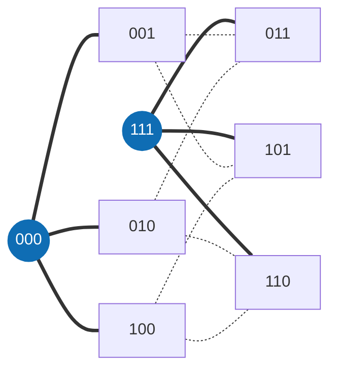

<div align="center">

[English](README.md) · **Português** · [Français](README.fr.md)

<picture>
  <source media="(prefers-color-scheme: dark)" srcset="docs/assets/banner-escuro.png">
  <source media="(prefers-color-scheme: light)" srcset="docs/assets/banner-claro.png">
  
</picture>

# Matemática

**Descoberta cara, verificação barata: cotas de códigos de cobertura que um avaliador exato e o kernel do Lean conferem.**

[](https://github.com/thiagopatzdorf/Matematica/actions/workflows/ci.yml)
[](https://github.com/thiagopatzdorf/Matematica/actions/workflows/verify-codes.yml)
[](https://doi.org/10.5281/zenodo.23085769)
[](https://lean-lang.org)
[](LICENSE)

[Página](https://genesisinnovation.io/matematica) ·
[Resultados](docs/resultados.md) ·
[Filosofia](docs/FILOSOFIA.md) ·
[Documentação](docs/README.md) ·
[Nota](paper/main.pdf)

</div>

---

## O problema em uma imagem

Imagine uma cidade onde cada casa tem um endereço de `n` letras, e a distância entre duas casas é quantas letras
é preciso trocar para ir de um endereço ao outro. Uma torre alcança todas as casas a até `R` trocas. **Qual é o
menor número de torres que cobre a cidade inteira?** Esse número é `K_q(n,R)`.

No menor exemplo interessante, os endereços são as 8 palavras de 3 bits e cada torre alcança uma troca. Duas
torres, em `000` e `111`, bastam: toda outra palavra está a um bit de uma delas. Uma torre só cobre 4 casas, então
`K_2(3,1) = 2`.



Toda resposta tem dois lados. A **cota superior** é mostrar torres que bastam: achar é difícil, mas conferir é só
contar. A **cota inferior** é provar que menos torres é impossível, e esse é o lado difícil, porque é preciso
descartar todas as alternativas. Explicado em quatro camadas (30 segundos, ensino médio, graduação, pesquisa) em
[docs/EXPLICANDO.md](docs/EXPLICANDO.md); o porquê do método, em [docs/FILOSOFIA.md](docs/FILOSOFIA.md).

## I. Definição

Um **código de cobertura** é um conjunto de palavras de comprimento `n` sobre `q` símbolos tal que toda palavra do
espaço fica a distância de Hamming no máximo `R` de alguma delas. `K_q(n,R)` é o tamanho do menor código assim:

```math
K_q(n,R) \;=\; \min\bigl\lbrace\,|C| \;:\; C \subseteq \mathbb{Z}_q^n,\ \ \forall x \in \mathbb{Z}_q^n\ \ \exists c \in C,\ \ d_H(x,c) \le R \,\bigr\rbrace
```

Uma cota superior é um código explícito: achar é difícil, conferir é contar. A referência são as
[tabelas do Kéri](https://old.sztaki.hu/~keri/codes/); o vocabulário inteiro está no [glossário](docs/GLOSSARIO.md).

## II. Princípios

1. **Só conta o que a máquina confere.** Prova é um avaliador determinístico ou o kernel do Lean. Opinião de modelo, ou de gente, não é prova.
2. **Verificação barata vale mais que descoberta cara.** A busca pode ser cara e falível; o que fica no repositório é o certificado que se confere em segundos.
3. **Todo erro vira regra.** Um defeito achado vira teste que falha, não lembrete.
4. **Tudo é reversível.** Cada estado é reconstruível a partir do repositório: códigos, certificados, ledger e provas.

O porquê de cada um está em [docs/FILOSOFIA.md](docs/FILOSOFIA.md).

## III. Proposições

A machine-checked ledger of covering-code upper bounds, with formally certified exact entries.
O bloco abaixo é gerado a partir de `ledger/cells.json` e não se edita à mão.

<!-- RESULTADOS:INICIO -->
<!-- Gerado por tools/site/gerar_resultados.py a partir de ledger/cells.json; não edite à mão. -->

> A machine-checked ledger of covering-code upper bounds, with formally certified exact entries.

| o quê | valor |
|---|---:|
| células `K_q(n,R)` no ledger (q de 2 a 21) | **1145** |
| exatas (cota inferior = superior) | **523** |
| abertas | **622** |
| cotas superiores que são teorema do kernel do Lean (FORMALIZED + INDEPENDENTLY_REPRODUCED) | **700** de 1145 (579 + 121) |
| cotas inferiores por estado (quase todas herdadas da literatura) | CLAIMED 1140 · CERTIFICATE_VERIFIED 3 · FORMALIZED 2 |
| exatas fechadas aqui (o intervalo publicado estava aberto) | **4** (1 com as duas cotas no kernel; 3 com a inferior por certificado verificado fora do Lean) |
| células com teorema Lean próprio | **110** (12 abaixo da melhor cota superior publicada que achamos) |
| códigos explícitos em `data/codes/` | **44** (todos passam no verificador C oficial, `tools/verify/check_all.sh`, no CI); 38 são a testemunha atual de uma cota do ledger, sha256 conferido |

Versão 0.9.1 · DOI [10.5281/zenodo.23085769](https://doi.org/10.5281/zenodo.23085769) · ledger atualizado em 2026-10-06. As cotas inferiores **não** estão, em geral, no Lean: só 2 delas são teorema do kernel.

### Destaques

Células com resultado próprio: teorema Lean nosso ou cota inferior por certificado verificado. Exatas novas primeiro; depois, maior ganho relativo na cota superior.

| célula | antes (publicado) | agora | estado inferior | estado superior | prova |
|---|---:|---:|---|---|---|
| `K_7(6,4)` | 13–15 | **= 14** | CERTIFICATE_VERIFIED | INDEPENDENTLY_REPRODUCED | [FIBRAS_GERAL](docs/exatos/FIBRAS_GERAL.md) · `CoveringK764.K_7_6_4_le_14` · [código](data/codes/q7_n6_R4_M14.txt) |
| `K_3(6,2)` | 15–17 | **= 17** | CERTIFICATE_VERIFIED | INDEPENDENTLY_REPRODUCED | [K3_M16](docs/exatos/k362/K3_M16.md) · `CoveringLedger.K3_6_2_le_17` |
| `K_7(5,3)` | 15–17 | **= 17** | CERTIFICATE_VERIFIED | INDEPENDENTLY_REPRODUCED | [FIBRAS_GERAL](docs/exatos/FIBRAS_GERAL.md) · `CoveringK753.K_7_5_3_le_17` · [código](data/codes/q7_n5_R3_M17.txt) |
| `K_7(4,2)` | 17–19 | **= 19** | FORMALIZED | FORMALIZED | [FASE1_B_K742](docs/exatos/FASE1_B_K742.md) · `K742.K_7_4_2_le_19` · `K742.K_7_4_2_eq_19` |
| `K_5(10,4)` | 177–875 | 177–**625** (−28,6 %) | CLAIMED | INDEPENDENTLY_REPRODUCED | `CoveringKernel.K5_10_4_le_625_kernel` · [código](data/codes/q5_n10_R4_M625.txt) |
| `K_7(9,4)` | 264–1475 | 264–**1134** (−23,1 %) | CLAIMED | INDEPENDENTLY_REPRODUCED | `Syn.K7_9_4_le_1134_syn` · [código](data/codes/q7_n9_R4_M1134.txt) |
| `K_7(8,3)` | 471–2337 | 471–**1887** (−19,3 %) | CLAIMED | INDEPENDENTLY_REPRODUCED | `Syn.K7_8_3_le_1887_syn` · [código](data/codes/q7_n8_R3_M1887.txt) |
| `K_7(10,4)` | 1007–6517 | 1007–**5607** (−14,0 %) | CLAIMED | INDEPENDENTLY_REPRODUCED | `Syn.K7_10_4_le_5607_syn` · [código](data/codes/q7_n10_R4_M5607.txt) |
| `K_5(9,5)` | 19–55 | 19–**50** (−9,1 %) | CLAIMED | INDEPENDENTLY_REPRODUCED | `CoveringKernel.K5_9_5_le_50_kernel` · [código](data/codes/q5_n9_R5_M50.txt) |
| `K_5(11,4)` | 546–3125 | 546–**2875** (−8,0 %) | CLAIMED | INDEPENDENTLY_REPRODUCED | `Syn.K5_11_4_le_2875_syn` · [código](data/codes/q5_n11_R4_M2875.txt) |
| `K_4(10,4)` | 62–208 | 62–**192** (−7,7 %) | CLAIMED | INDEPENDENTLY_REPRODUCED | `CoveringKernel.K4_10_4_le_192_kernel` · [código](data/codes/q4_n10_R4_M192.txt) |
| `K_5(10,5)` | 41–175 | 41–**162** (−7,4 %) | CLAIMED | INDEPENDENTLY_REPRODUCED | `Syn.K5_10_5_le_162_syn` · [código](data/codes/q5_n10_R5_M162.txt) |
| `K_5(7,2)` | 236–525 | 236–**500** (−4,8 %) | CLAIMED | INDEPENDENTLY_REPRODUCED | `CoveringKernel.K5_7_2_le_500_kernel` · [código](data/codes/q5_n7_R2_M500.txt) |
| `K_5(9,3)` | 354–1275 | 354–**1250** (−2,0 %) | CLAIMED | INDEPENDENTLY_REPRODUCED | `CoveringKernel.K5_9_3_le_1250_kernel` · [código](data/codes/q5_n9_R3_M1250.txt) |
| `K_5(9,4)` | 64–255 | 64–**250** (−2,0 %) | CLAIMED | INDEPENDENTLY_REPRODUCED | `CoveringKernel.K5_9_4_le_250_kernel` · [código](data/codes/q5_n9_R4_M250.txt) |
| `K_2(6,1)` | = 12 | **= 12** | FORMALIZED | FORMALIZED | `SC.K_2_6_1_eq12` |
| `K_2(12,3)` | 19–28 | 19–28 | CLAIMED | INDEPENDENTLY_REPRODUCED | `CoveringLit.K2_12_3_le_28` · [código](data/codes/q2_n12_R3_M28.txt) |
| `K_2(13,1)` | 607–704 | 607–704 | CLAIMED | INDEPENDENTLY_REPRODUCED | `Syn.K2_13_1_le_704_syn` · [código](data/codes/q2_n13_R1_M704.txt) |
| `K_2(13,3)` | 28–42 | 28–42 | CLAIMED | INDEPENDENTLY_REPRODUCED | `CoveringLit.K2_13_3_le_42` · [código](data/codes/q2_n13_R3_M42.txt) |
| `K_2(14,1)` | 1185–1408 | 1185–1408 | CLAIMED | FORMALIZED | `CoveringLit.K2_14_1_le_1408` |
| `K_2(14,4)` | 16–28 | 16–28 | CLAIMED | INDEPENDENTLY_REPRODUCED | `CoveringLit.K2_14_4_le_28` · [código](data/codes/q2_n14_R4_M28.txt) |
| `K_2(15,2)` | 310–384 | 310–384 | CLAIMED | INDEPENDENTLY_REPRODUCED | `Syn.K2_15_2_le_384_syn` · [código](data/codes/q2_n15_R2_M384.txt) |
| `K_2(15,4)` | 23–32 | 23–32 | CLAIMED | INDEPENDENTLY_REPRODUCED | `CoveringLit.K2_15_4_le_32` · [código](data/codes/q2_n15_R4_M32.txt) |
| `K_2(17,3)` | 187–320 | 187–320 | CLAIMED | INDEPENDENTLY_REPRODUCED | `Syn.K2_17_3_le_320_syn` · [código](data/codes/q2_n17_R3_M320.txt) |
| `K_2(17,5)` | 20–32 | 20–32 | CLAIMED | INDEPENDENTLY_REPRODUCED | `Syn.K2_17_5_le_32_syn` · [código](data/codes/q2_n17_R5_M32.txt) |
| `K_2(18,2)` | 1702–2944 | 1702–2944 | CLAIMED | INDEPENDENTLY_REPRODUCED | `Syn.K2_18_2_le_2944_syn` · [código](data/codes/q2_n18_R2_M2944.txt) |
| `K_2(18,3)` | 316–512 | 316–512 | CLAIMED | INDEPENDENTLY_REPRODUCED | `Syn.K2_18_3_le_512_syn` · [código](data/codes/q2_n18_R3_M512.txt) |
| `K_2(19,4)` | 128–256 | 128–256 | CLAIMED | INDEPENDENTLY_REPRODUCED | `Syn.K2_19_4_le_256_syn` · [código](data/codes/q2_n19_R4_M256.txt) |
| `K_2(19,6)` | 17–32 | 17–32 | CLAIMED | INDEPENDENTLY_REPRODUCED | `Syn.K2_19_6_le_32_syn` · [código](data/codes/q2_n19_R6_M32.txt) |
| `K_2(21,3)` | 1475–3072 | 1475–3072 | CLAIMED | FORMALIZED | `Syn.K2_21_3_le_3072_syn` |
| `K_2(23,4)` | 912–2048 | 912–2048 | CLAIMED | FORMALIZED | `Syn.K2_23_4_le_2048_syn` |
| `K_2(24,5)` | 376–1024 | 376–1024 | CLAIMED | FORMALIZED | `Syn.K2_24_5_le_1024_syn` |
| `K_6(5,2)` | 36–66 | 36–66 | CLAIMED | INDEPENDENTLY_REPRODUCED | `CoveringLit.K6_5_2_le_66` · [código](data/codes/q6_n5_R2_M66.txt) |
| `K_6(6,4)` | = 10 | **= 10** | CLAIMED | INDEPENDENTLY_REPRODUCED | `CoveringLit.K6_6_4_le_10` · [código](data/codes/q6_n6_R4_M10.txt) |
| `K_6(7,4)` | 18–36 | 18–36 | CLAIMED | INDEPENDENTLY_REPRODUCED | `CoveringLit.K6_7_4_le_36` · [código](data/codes/q6_n7_R4_M36.txt) |
| `K_6(10,6)` | 25–72 | 25–72 | CLAIMED | FORMALIZED | `CoveringLit.K6_10_6_le_72` |
| `K_7(5,2)` | 55–97 | 55–97 | CLAIMED | INDEPENDENTLY_REPRODUCED | `CoveringLit.K7_5_2_le_97` · [código](data/codes/q7_n5_R2_M97.txt) |
| `K_7(7,5)` | = 11 | **= 11** | CLAIMED | INDEPENDENTLY_REPRODUCED | `CoveringLit.K7_7_5_le_11` · [código](data/codes/q7_n7_R5_M11.txt) |
| `K_7(9,6)` | 17–37 | 17–37 | CLAIMED | FORMALIZED | `CoveringLit.K7_9_6_le_37` |
| `K_8(5,2)` | 83–128 | 83–128 | CLAIMED | INDEPENDENTLY_REPRODUCED | `CoveringLit.K8_5_2_le_128` · [código](data/codes/q8_n5_R2_M128.txt) |
| `K_8(7,4)` | 37–92 | 37–92 | CLAIMED | INDEPENDENTLY_REPRODUCED | `CoveringLit.K8_7_4_le_92` · [código](data/codes/q8_n7_R4_M92.txt) |
| `K_8(7,5)` | 14–16 | 14–16 | CLAIMED | INDEPENDENTLY_REPRODUCED | `CoveringLit.K8_7_5_le_16` · [código](data/codes/q8_n7_R5_M16.txt) |
| `K_8(8,6)` | = 12 | **= 12** | CLAIMED | FORMALIZED | `CoveringLit.K8_8_6_le_12` |
| `K_8(9,6)` | 22–48 | 22–48 | CLAIMED | FORMALIZED | `CoveringLit.K8_9_6_le_48` |
| `K_9(5,2)` | 113–189 | 113–189 | CLAIMED | INDEPENDENTLY_REPRODUCED | `CoveringLit.K9_5_2_le_189` · [código](data/codes/q9_n5_R2_M189.txt) |
| `K_9(7,4)` | 51–120 | 51–120 | CLAIMED | INDEPENDENTLY_REPRODUCED | `CoveringLit.K9_7_4_le_120` · [código](data/codes/q9_n7_R4_M120.txt) |
| `K_9(7,5)` | 16–21 | 16–21 | CLAIMED | INDEPENDENTLY_REPRODUCED | `CoveringLit.K9_7_5_le_21` · [código](data/codes/q9_n7_R5_M21.txt) |
| `K_9(8,6)` | 15–17 | 15–17 | CLAIMED | FORMALIZED | `CoveringLit.K9_8_6_le_17` |
| `K_9(9,7)` | = 13 | **= 13** | CLAIMED | FORMALIZED | `CoveringLit.K9_9_7_le_13` |
| `K_10(5,2)` | 149–250 | 149–250 | CLAIMED | INDEPENDENTLY_REPRODUCED | `CoveringLit.K10_5_2_le_250` · [código](data/codes/q10_n5_R2_M250.txt) |
| `K_10(7,5)` | 19–26 | 19–26 | CLAIMED | INDEPENDENTLY_REPRODUCED | `CoveringLit.K10_7_5_le_26` · [código](data/codes/q10_n7_R5_M26.txt) |
| `K_10(8,6)` | 17–22 | 17–22 | CLAIMED | FORMALIZED | `CoveringLit.K10_8_6_le_22` |
| `K_10(9,7)` | 16–18 | 16–18 | CLAIMED | FORMALIZED | `CoveringLit.K10_9_7_le_18` |
| `K_10(10,8)` | = 14 | **= 14** | CLAIMED | FORMALIZED | `CoveringLit.K10_10_8_le_14` |
| `K_11(7,5)` | 22–31 | 22–31 | CLAIMED | FORMALIZED | `CoveringLit.K11_7_5_le_31` |
| `K_11(8,6)` | 20–27 | 20–27 | CLAIMED | FORMALIZED | `CoveringLit.K11_8_6_le_27` |
| `K_12(5,2)` | 256–468 | 256–468 | CLAIMED | FORMALIZED | `CoveringLit.K12_5_2_le_468` |
| `K_12(7,5)` | 25–36 | 25–36 | CLAIMED | FORMALIZED | `CoveringLit.K12_7_5_le_36` |
| `K_12(8,6)` | 23–32 | 23–32 | CLAIMED | FORMALIZED | `CoveringLit.K12_8_6_le_32` |
| `K_13(4,2)` | = 57 | **= 57** | CLAIMED | FORMALIZED | `CoveringLit.K13_4_2_le_57` |
| `K_13(7,5)` | 29–42 | 29–42 | CLAIMED | FORMALIZED | `CoveringLit.K13_7_5_le_42` |
| `K_13(8,6)` | 25–37 | 25–37 | CLAIMED | FORMALIZED | `CoveringLit.K13_8_6_le_37` |
| `K_14(4,2)` | = 66 | **= 66** | CLAIMED | FORMALIZED | `CoveringLit.K14_4_2_le_66` |
| `K_14(5,2)` | 381–686 | 381–686 | CLAIMED | FORMALIZED | `CoveringLit.K14_5_2_le_686` |
| `K_14(5,3)` | 50–54 | 50–54 | CLAIMED | FORMALIZED | `CoveringLit.K14_5_3_le_54` |
| `K_14(7,3)` | 1570–4802 | 1570–4802 | CLAIMED | FORMALIZED | `CoveringLit.K14_7_3_le_4802` |
| `K_14(7,5)` | 34–48 | 34–48 | CLAIMED | FORMALIZED | `CoveringLit.K14_7_5_le_48` |
| `K_14(8,6)` | 29–42 | 29–42 | CLAIMED | FORMALIZED | `CoveringLit.K14_8_6_le_42` |
| `K_15(4,2)` | = 75 | **= 75** | CLAIMED | FORMALIZED | `CoveringLit.K15_4_2_le_75` |
| `K_15(5,2)` | 465–855 | 465–855 | CLAIMED | FORMALIZED | `CoveringLit.K15_5_2_le_855` |
| `K_15(5,3)` | 57–59 | 57–59 | CLAIMED | FORMALIZED | `CoveringLit.K15_5_3_le_59` |
| `K_15(7,3)` | 1745–6497 | 1745–6497 | CLAIMED | FORMALIZED | `CoveringLit.K15_7_3_le_6497` |
| `K_15(7,5)` | 39–54 | 39–54 | CLAIMED | FORMALIZED | `CoveringLit.K15_7_5_le_54` |
| `K_15(8,6)` | 33–49 | 33–49 | CLAIMED | FORMALIZED | `CoveringLit.K15_8_6_le_49` |
| `K_16(4,2)` | 86–87 | 86–87 | CLAIMED | FORMALIZED | `CoveringLit.K16_4_2_le_87` |
| `K_16(5,2)` | 576–1024 | 576–1024 | CLAIMED | FORMALIZED | `CoveringLit.K16_5_2_le_1024` |
| `K_16(5,3)` | = 64 | **= 64** | CLAIMED | FORMALIZED | `CoveringLit.K16_5_3_le_64` |
| `K_16(7,3)` | 2226–8192 | 2226–8192 | CLAIMED | FORMALIZED | `CoveringLit.K16_7_3_le_8192` |
| `K_16(7,5)` | 44–60 | 44–60 | CLAIMED | FORMALIZED | `CoveringLit.K16_7_5_le_60` |
| `K_16(8,6)` | 38–56 | 38–56 | CLAIMED | FORMALIZED | `CoveringLit.K16_8_6_le_56` |
| `K_17(4,2)` | 97–99 | 97–99 | CLAIMED | FORMALIZED | `CoveringLit.K17_4_2_le_99` |
| `K_17(5,2)` | 671–1241 | 671–1241 | CLAIMED | FORMALIZED | `CoveringLit.K17_5_2_le_1241` |
| `K_17(5,3)` | = 73 | **= 73** | CLAIMED | FORMALIZED | `CoveringLit.K17_5_3_le_73` |
| `K_17(7,3)` | 2806–10657 | 2806–10657 | CLAIMED | FORMALIZED | `CoveringLit.K17_7_3_le_10657` |
| `K_17(7,5)` | 49–66 | 49–66 | CLAIMED | FORMALIZED | `CoveringLit.K17_7_5_le_66` |
| `K_17(8,6)` | 43–63 | 43–63 | CLAIMED | FORMALIZED | `CoveringLit.K17_8_6_le_63` |
| `K_18(4,2)` | 109–111 | 109–111 | CLAIMED | FORMALIZED | `CoveringLit.K18_4_2_le_111` |
| `K_18(5,2)` | 807–1458 | 807–1458 | CLAIMED | FORMALIZED | `CoveringLit.K18_5_2_le_1458` |
| `K_18(5,3)` | = 82 | **= 82** | CLAIMED | FORMALIZED | `CoveringLit.K18_5_3_le_82` |
| `K_18(6,4)` | 66–80 | 66–80 | CLAIMED | FORMALIZED | `CoveringLit.K18_6_4_le_80` |
| `K_18(7,3)` | 3492–13122 | 3492–13122 | CLAIMED | FORMALIZED | `CoveringLit.K18_7_3_le_13122` |
| `K_18(7,5)` | 55–72 | 55–72 | CLAIMED | FORMALIZED | `CoveringLit.K18_7_5_le_72` |
| `K_18(8,6)` | 48–70 | 48–70 | CLAIMED | FORMALIZED | `CoveringLit.K18_8_6_le_70` |
| `K_19(4,2)` | 121–123 | 121–123 | CLAIMED | FORMALIZED | `CoveringLit.K19_4_2_le_123` |
| `K_19(5,3)` | = 91 | **= 91** | CLAIMED | FORMALIZED | `CoveringLit.K19_5_3_le_91` |
| `K_19(6,4)` | 73–86 | 73–86 | CLAIMED | FORMALIZED | `CoveringLit.K19_6_4_le_86` |
| `K_19(7,3)` | 4282–18737 | 4282–18737 | CLAIMED | FORMALIZED | `CoveringLit.K19_7_3_le_18737` |
| `K_19(7,5)` | 61–81 | 61–81 | CLAIMED | FORMALIZED | `CoveringLit.K19_7_5_le_81` |
| `K_19(8,6)` | 53–77 | 53–77 | CLAIMED | FORMALIZED | `CoveringLit.K19_8_6_le_77` |
| `K_20(4,2)` | 134–135 | 134–135 | CLAIMED | FORMALIZED | `CoveringLit.K20_4_2_le_135` |
| `K_20(5,3)` | = 100 | **= 100** | CLAIMED | FORMALIZED | `CoveringLit.K20_5_3_le_100` |
| `K_20(6,4)` | 81–93 | 81–93 | CLAIMED | FORMALIZED | `CoveringLit.K20_6_4_le_93` |
| `K_20(7,3)` | 5215–21202 | 5215–21202 | CLAIMED | FORMALIZED | `CoveringLit.K20_7_3_le_21202` |
| `K_20(7,5)` | 68–89 | 68–89 | CLAIMED | FORMALIZED | `CoveringLit.K20_7_5_le_89` |
| `K_20(8,6)` | 58–84 | 58–84 | CLAIMED | FORMALIZED | `CoveringLit.K20_8_6_le_84` |
| `K_21(4,2)` | = 147 | **= 147** | CLAIMED | FORMALIZED | `CoveringLit.K21_4_2_le_147` |
| `K_21(5,3)` | 111–114 | 111–114 | CLAIMED | FORMALIZED | `CoveringLit.K21_5_3_le_114` |
| `K_21(6,4)` | 89–99 | 89–99 | CLAIMED | FORMALIZED | `CoveringLit.K21_6_4_le_99` |
| `K_21(7,4)` | 497–1029 | 497–1029 | CLAIMED | FORMALIZED | `CoveringLit.K21_7_4_le_1029` |
| `K_21(7,5)` | 75–98 | 75–98 | CLAIMED | FORMALIZED | `CoveringLit.K21_7_5_le_98` |
| `K_21(8,6)` | 64–91 | 64–91 | CLAIMED | FORMALIZED | `CoveringLit.K21_8_6_le_91` |

Potencialmente novas (não encontradas na literatura que pesquisamos, ver [NOVIDADE_V09](docs/exatos/NOVIDADE_V09.md)): `K_7(6,4)`, `K_3(6,2)`, `K_7(5,3)`.

Lacunas declaradas: a cota inferior de `K_7(6,4)`, `K_3(6,2)`, `K_7(5,3)` é certificado computacional verificado, não teorema do Lean.
<!-- RESULTADOS:FIM -->

## IV. Demonstração

Toda cota sobe uma escada de estados, e cada degrau exige uma conferência mais forte que o anterior:

<p align="center">
  
</p>

| estado | o que foi conferido |
|---|---|
| `CLAIMED` | está numa fonte publicada; nada foi conferido aqui |
| `WITNESS_CHECKED` | um verificador exato, fora do Lean, aceitou o certificado |
| `CERTIFICATE_VERIFIED` | só cota inferior: certificados LRAT, VeriPB ou Farkas fixados por sha256, conferidos por verificador independente do gerador e com red team |
| `FORMALIZED` | há teorema do Lean, checado pelo kernel, sem hipótese pendente |
| `INDEPENDENTLY_REPRODUCED` | formalizado **e** conferido por um segundo verificador, executado |

A definição completa de cada degrau está em [ledger/README.md](ledger/README.md); a contagem por estado, em
[ledger/COBERTURA.md](ledger/COBERTURA.md). Para reproduzir, bastam três comandos (precisa de `cc`, Python 3 e
[elan](https://lean-lang.org/install/)):

```bash
git clone https://github.com/thiagopatzdorf/Matematica && cd Matematica
tools/verify/check_all.sh          # todo código de data/codes/ no verificador oficial em C
lake exe cache get && lake build   # as provas no kernel do Lean
```

## V. Método

<p align="center">
  
</p>

O método é um colapso: muitos candidatos (busca, SAT, construções algébricas, agentes) entram, um avaliador exato
decide, e o que sobra é estrutura conferível. O fluxo real, arquivo por arquivo, está em
[docs/ARQUITETURA.md](docs/ARQUITETURA.md); a versão visual, em
[genesisinnovation.io/matematica](https://genesisinnovation.io/matematica).

## VI. Horizonte

O mesmo princípio sustenta o [teorema do James](https://github.com/thiagopatzdorf/james-theorems), em que descobrir
é caro e verificar é barato. Os [Problemas do Milênio](https://www.claymath.org/millennium-problems/) são a inspiração
de longo prazo do método, não algo que este repositório resolva ou ataque.

## VII. Contribua · Cite · Licença

**Contribua.** Escolha uma célula com `python3 ledger/targets.py --top 10`, abra uma issue dizendo qual você ataca e
siga o [CONTRIBUTING.md](CONTRIBUTING.md). Agentes começam pelo [AGENTS.md](AGENTS.md) e pelo
[MCP Infinito](infinito/README.md).

**Cite.** DOI conceitual [10.5281/zenodo.23085769](https://doi.org/10.5281/zenodo.23085769), que aponta sempre para
a versão mais nova. Os metadados estão em `CITATION.cff`, e o GitHub oferece o botão "Cite this repository".

**Licença.** [CC BY 4.0](LICENSE). Conduta: [CODE_OF_CONDUCT.md](CODE_OF_CONDUCT.md). Segurança: [SECURITY.md](SECURITY.md).
