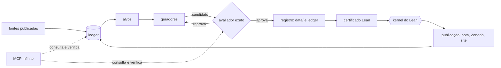

# Arquitetura: do ledger à publicação

O fluxo é o mesmo para qualquer célula: o ledger diz onde há chance, um gerador propõe candidatos, um avaliador
exato decide, o kernel do Lean certifica e o dono publica. A peça que decide é o avaliador; o gerador pode ser
burro, ou um modelo, desde que nunca seja o juiz.

## Etapa por etapa

| etapa | o que faz | arquivos reais |
|---|---|---|
| fontes e ledger | junta as cotas publicadas (Kéri, Gijswijt–Polak, Marosi, Florath) nos commits fixados e o nosso estado | `ledger/sources.json`, `ledger/build.py`, `ledger/cells.json`, `ledger/ours.json`, `ledger/provenance.json` |
| alvos | ranqueia onde buscar; lista células com pouca folga para fechar | `ledger/targets.py`, `tools/exatos/folgas.py` |
| geradores | propõem códigos: base linear mais remendo, recozimento, ILP, busca exaustiva, SAT | `scripts/search/gen.py`, `scripts/search/patch_lns.py`, `scripts/attack/`, `scripts/loop/gen_greedy.py`, `tools/exatos/sa_cover.c`, `tools/exatos/dfs_cover.c`, `tools/exatos/cpsat_cover.py`, `tools/exatos/k742/rodar.py` |
| avaliadores | decidem de forma exata se o candidato cobre; conferem formato e sha256 | `tools/verify/verify.c`, `tools/verify/check_all.sh`, `scripts/loop/verify_cover.py`, `scripts/codes/expand.py`, `verification/` |
| registro | grava o código, a descrição estruturada, a proveniência e atualiza o ledger | `scripts/loop/record_loop.py`, `data/codes/`, `data/structured/`, `scripts/codes/build_structured.py` |
| certificado Lean | transforma o código em teorema `∃ C, C.card = M ∧ Covers R C` | `scripts/syndrome/gen_syn.py`, `scripts/k794/gen.py`, `CoveringLean/SynCheck.lean`, `CoveringLean/SynBridge.lean`, `CoveringLean/Syn_K1137.lean`, `CoveringLean/C1_Data_K7_9_4.lean`, `CoveringLean/Regras.lean` (K ≤ \|C\| genérico e regras de construção), `lakefile.toml` |
| CI | confere códigos e testes, e roda `lake build` e os axiomas dos certificados | `.github/workflows/verify-codes.yml`, `.github/workflows/lean-syn.yml` |
| publicação | nota, nova versão no Zenodo e página pública, a partir do ledger; só o dono publica | `paper/main.tex`, `scripts/publish/zenodo_newversion.py`, `scripts/publish/github_release.py`, `scripts/publish/genesis_page.py`, `.zenodo.json`, `CITATION.cff` |
| acesso de colaboradores | ferramentas MCP com crédito por pessoa em volta das etapas acima | `infinito/infinito_mcp/server.py`, `infinito/infinito_mcp/modulos/matematica.py` |

## Regras que seguram o desenho

* **Verificar é mais barato que achar.** Por isso cabe um avaliador exato antes de qualquer afirmação.
* **O certificado não confia no gerador.** O teorema Lean lê o código explícito; a busca pode ser irreprodutível e a
  prova continua valendo. A proveniência existe para a busca ser reproduzível, não para a prova.
* **O ledger é saída, não entrada.** Ele é reconstruído das fontes e do estado nosso; o teste de ledger compara o commitado com o reconstruído do recorte das fontes.
* **Prova de inexistência vem de Lean ou LRAT**, nunca de um `INFEASIBLE` de script (`tools/exatos/README.md`).
* **Publicar e fazer merge ficam fora do alcance dos agentes**, inclusive no MCP.

## Onde o hub cresce

O domínio de códigos de cobertura é o primeiro. Um novo domínio entra com o mesmo trio: fonte de problemas (ledger
próprio), avaliador exato e certificado. A pasta de problemas e a de avaliadores estão em construção; ver a seção
final de [CONTRIBUTING.md](../CONTRIBUTING.md).
