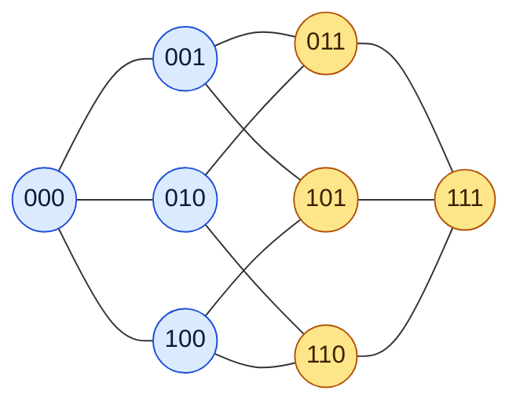
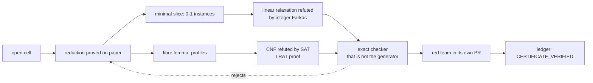
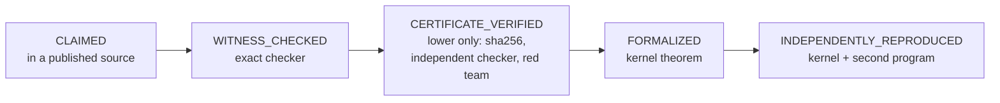

[Português](EXPLICANDO.md) · **English** · [Français](EXPLIQUE.md)

# Explained: Kéri's covering-code bounds, from laypeople to PhDs

Four layers. Each one is complete in itself: stop wherever you like.
Every number comes from the repository ([`ledger/cells.json`](../ledger/cells.json),
[`ledger/COBERTURA.md`](../ledger/COBERTURA.md), [the paper](../paper/main.tex)).
The philosophy behind it is in [PHILOSOPHY](PHILOSOPHY.md).

---

## 1. For anyone · 30 seconds

Picture a city.
You have to put up cell towers.
Each tower reaches the houses near it.
**What is the smallest number of towers that covers every house?**

Now replace the houses with words.
The distance between two words is how many letters you must change to turn one into the other:
`CAST` and `CART` are at distance 1; `CAST` and `CARE`, at distance 2.

The number `K_q(n,R)` is that smallest number of towers:
words of `n` letters, over an alphabet of `q` letters, each tower reaching up to `R` changes.

**Where did this come from?** From the football pools. The name is in the title of one of the
classic papers of the field (Hämäläinen and Rankinen, 1991, cited [in the paper](../paper/main.tex)).
Each match has three outcomes: home win, draw, away win.
How many coupons must you fill in to be sure of getting at most one match wrong?
That is `K₃(n,1)`, with `n` matches.

- With 4 matches: **9 coupons** suffice, and 8 is impossible.
- With 13 matches: **59 049 coupons**, and this value is exact.
- With 6 matches: **no one knows yet.** Between 71 and 73.

(Values of `K3(4,1)`, `K3(13,1)` and `K3(6,1)` in the [ledger](../ledger/cells.json).)

---

## 2. High school · showing is easy, proving it cannot be done is hard

### A small example, solved by hand

Words of 3 bits: `000`, `001`, …, `111`. There are 8. They are the corners of a cube, and two
neighbouring corners differ in exactly one bit.

With radius 1, each word covers itself and its 3 neighbours: 4 corners.

- **One word is not enough.** It covers only 4 of the 8 corners.
- **Two are enough.** `000` covers the blue side; `111` covers the yellow side. Together, the whole cube.

So `K₂(3,1) = 2`. Done.

### Upper bound and lower bound

You almost never hit the exact value at once. What you have is an interval:

    lower bound  ≤  K_q(n,R)  ≤  upper bound

- **Upper bound:** "it can be done with `M`". It is proved by **showing** a code with `M` words.
  Checking is easy: for each word of the space, find a codeword within distance `R`.
- **Lower bound:** "fewer than `M` is impossible". Showing does not help here. You must **rule out
  every attempt**, or find an argument that spares you from testing them.

Why is the second so much harder? In `K₃(6,2)` there are 729 words. Checking a 17-word code means
comparing 729 words against 17. But the number of ways to choose 16 words out of 729 exceeds 10³²
(direct computation of `C(729,16)`). No one tests that one by one. You have to think.

It is the asymmetry of a key: showing that it opens the door takes a second. Proving that no smaller
key opens it means thinking about every key.

---

## 3. Undergraduate · Hamming balls and a space that explodes

### The ball and the sphere-covering bound

The **Hamming ball** of radius `R` around a word has

    V_q(n,R) = Σ_{i=0..R} C(n,i) (q−1)^i

words: choose `i` positions and change each to one of the `q−1` other symbols.
The balls of a code with `M` words must cover all `q^n` words of the space, so

    K_q(n,R)  ≥  q^n / V_q(n,R)        (sphere-covering bound)

When equality holds, the code is **perfect**: the balls tile the space with nothing left over. The cube
above is one case (8 / 4 = 2). So are the football pools: `K₃(4,1) = 9 = 81 / 9` and
`K₃(13,1) = 59 049`, the ternary Hamming codes. Almost always, though, the balls overlap, and the
sphere-covering bound stays far from the truth. It is like tiling a floor with round tiles.

### Why the problem explodes

The space has `q^n` words: it grows exponentially. For `K₇(9,4)` there are 40 353 607. And the number
of candidate codes is far larger than the space. That is why the tables are full of intervals that
have stayed open for decades.

### A complete example: K₃(6,2) = 17

| who | what | value |
|---|---|---|
| arithmetic | sphere-covering bound: 729 / 73, rounded up | ≥ 10 |
| Gijswijt–Polak | semidefinite programming | ≥ 13.12 |
| Blass–Litsyn, 1998 | lower bound | ≥ 14 |
| Bertolo–Östergård–Weakley, 2004 | lower bound | ≥ 15 |
| Hämäläinen–Rankinen, 1991 | explicit code | ≤ 17 |
| this repository, v0.9 | 15 and 16 are impossible | **= 17** |

(History and sources in [NOVIDADE_V09](exatos/NOVIDADE_V09.md) and in the [paper](../paper/main.tex).)
For 22 years, from 2004 until now, the interval stayed at 15–17. The new lower bound is
`CERTIFICATE_VERIFIED`: certificates checked by exact programs outside Lean, not a kernel theorem.

---

## 4. Graduate · PhD

### The object

`K_q(n,R)` is the domination number of the `R`-th power of the Hamming graph `H(n,q)`: the smallest set
of vertices whose closed balls of radius `R` cover `ℤ_q^n`. It is a *set cover* instance with `q^n`
sets and `q^n` elements. General reference: Cohen, Honkala, Litsyn and Lobstein, *Covering Codes*
(1997), cited in the [paper](../paper/main.tex).

### The literature

- **Kéri**: the reference tables, 1145 cells with `2 ≤ q ≤ 21`, last updated 2011-11-25
  ([NOVIDADE_V09](exatos/NOVIDADE_V09.md)).
- **Östergård** and coauthors: Bertolo–Östergård–Weakley (2004) and the alphabet-partition construction
  of Kéri–Östergård (2005).
- **Haas, Schlage-Puchta and Quistorff** (2009): the recursion `K_{q+1}(n+1,R+1) ≥ min{2(q+1), K_q(n,R)+1}`.
- **Gijswijt–Polak** (semidefinite bounds), **Marosi** (2026, codes and SDP) and **Florath** (2026, a
  Lean library of bounds). Sources pinned by commit in the [ledger](../ledger/README.md).

### The constructions (upper bounds)

Unions of cosets of a linear code plus a small patch, with certificates the Lean kernel checks: one
walks digit prefixes, the other works on syndromes. The largest jump is `K₇(9,4) ≤ 1134`, against 1475
published ([paper](../paper/main.tex)).

### The reductions (lower bounds)

**Minimal slice + linear programming (K₃(6,2)).** A minimal fibre `F(0,0)` and its projection are
normalized to canonical form under `S_q ≀ S_{n−1}`; a counting filter discards impossible slices. For
15 words, 12 049 0-1 instances remain; for 16, 12 674. The linear relaxation of each one is refuted by
integer Farkas multipliers: 12 054 and 13 099 certificates, checked in exact arithmetic. A second
pipeline sharing no code with the first (another reduction, another canonical form, VeriPB and LRAT
proofs) reproduced both steps.

**Fibre lemma + SAT/LRAT (K₇(6,4), K₇(5,3)).** For `R = n−2`, a fibre with `s < q` words forces
`K_{q−s}(n−1,R−1) ≤ M−s`. This bounds the fibre sizes and reduces the problem to *profiles* (the
multiset of fibre sizes per coordinate), each encoded as a CNF and refuted by CaDiCaL with an LRAT proof
checked by `lrat-check`. `K₇(6,4)`: 8 008 profiles for 13 words. `K₇(5,3)`: one profile for 15 and
201 376 profiles for 16, two of them split into 1812 and 4953 cubes.

**Inside the kernel (K₇(4,2) = 19).** Here the whole proof is a Lean theorem: the reduction, an LRAT
checker written for the kernel with a soundness proof, and the refutations of the 70 profiles, in 284
modules and 37.8 CPU-hours ([LEAN_K742](exatos/LEAN_K742.md)).

### The ladder of states

| side | CLAIMED | WITNESS_CHECKED | CERTIFICATE_VERIFIED | FORMALIZED | INDEPENDENTLY_REPRODUCED |
|---|---:|---:|---:|---:|---:|
| upper | 658 | 0 | 0 | 435 | 52 |
| lower | 1140 | 0 | 3 | 2 | 0 |

(Counts from [`ledger/COBERTURA.md`](../ledger/COBERTURA.md).) A machine-checked ledger of
covering-code upper bounds, with formally certified exact entries. The whole table has **not** been
formally verified.

### Open gaps

- The lower bounds of `K₃(6,2)`, `K₇(6,4)` and `K₇(5,3)` rest on reductions proved on paper; they are
  not kernel theorems.
- `K₇(6,4)` and `K₇(5,3)` have not been independently reproduced in full: the independent encoding
  covered 16 of the 8 008 profiles and 8 cheap profiles, respectively ([paper](../paper/main.tex)).
- `K₇(5,3) ≤ 17` now has our own 17-word code and a Lean theorem (`CoveringK753.K_7_5_3_le_17`).
- Where the same methods stop: `K₃(7,3)` (11–12) and larger binary cells, recorded in the section
  "Where the same methods stop" of the [paper](../paper/main.tex). And the 6-match pool, `K₃(6,1)`,
  remains at 71–73.
