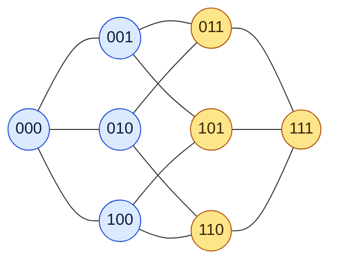
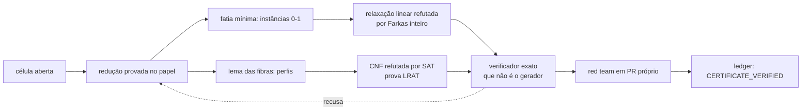
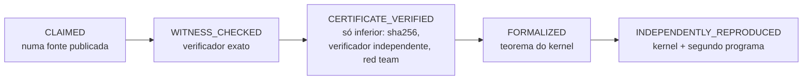

**Português** · [English](EXPLAINED.md) · [Français](EXPLIQUE.md)

# Explicando: as cotas de Kéri, de leigos a PhDs

Quatro camadas. Cada uma é completa em si: pare onde quiser.
Todo número vem do repositório ([`ledger/cells.json`](../ledger/cells.json),
[`ledger/COBERTURA.md`](../ledger/COBERTURA.md), [o paper](../paper/main.tex)).
A filosofia por trás está em [FILOSOFIA](FILOSOFIA.md).

---

## 1. Para qualquer pessoa · 30 segundos

Imagine uma cidade.
Você precisa instalar torres de celular.
Cada torre alcança as casas perto dela.
**Qual é o menor número de torres que cobre todas as casas?**

Agora troque as casas por palavras.
A distância entre duas palavras é quantas letras você precisa trocar para ir de uma à outra:
`CASA` e `COSA` estão a distância 1; `CASA` e `COLA`, a distância 2.

O número `K_q(n,R)` é o menor número de torres:
palavras de `n` letras, num alfabeto de `q` letras, cada torre alcançando até `R` trocas.

**De onde veio isso?** Do bolão de futebol — em inglês, *football pool*. O nome está no título de um
dos artigos clássicos da área (Hämäläinen e Rankinen, 1991, citado [no paper](../paper/main.tex)).
Cada jogo tem três resultados: coluna 1, empate, coluna 2.
Quantos cartões você precisa jogar para ter certeza de errar no máximo um jogo?
Isso é `K₃(n,1)`, com `n` jogos.

- Com 4 jogos: **9 cartões** bastam, e com 8 é impossível.
- Com 13 jogos: **59 049 cartões**, e esse valor é exato.
- Com 6 jogos: **ninguém sabe ainda.** Entre 71 e 73.

(Valores de `K3(4,1)`, `K3(13,1)` e `K3(6,1)` no [ledger](../ledger/cells.json).)

---

## 2. Ensino médio · mostrar é fácil, provar que não dá é difícil

### Um exemplo pequeno, resolvido à mão

Palavras de 3 bits: `000`, `001`, …, `111`. São 8. Elas são os vértices de um cubo, e duas palavras
vizinhas no cubo diferem em exatamente um bit.

Com raio 1, cada palavra cobre a si mesma e as 3 vizinhas: 4 vértices.

- **Uma palavra não basta.** Ela cobre só 4 dos 8 vértices.
- **Duas bastam.** `000` cobre o lado azul; `111` cobre o lado amarelo. Juntas, o cubo inteiro.

Logo `K₂(3,1) = 2`. Feito.

### Cota superior e cota inferior

Quase nunca se acerta o valor de primeira. O que se tem é um intervalo:

    cota inferior  ≤  K_q(n,R)  ≤  cota superior

- **Cota superior:** "dá com `M`". Prova-se **mostrando** um código com `M` palavras. Conferir é fácil:
  para cada palavra do espaço, ache uma do código a distância no máximo `R`.
- **Cota inferior:** "com menos de `M` é impossível". Aí mostrar não adianta. É preciso **descartar
  todas as tentativas**, ou achar um argumento que dispense testá-las.

Por que a segunda é tão mais difícil? Em `K₃(6,2)` há 729 palavras. Conferir um código de 17 palavras
é olhar 729 palavras contra 17. Mas o número de jeitos de escolher 16 palavras entre 729 passa de
10³² (conta direta de `C(729,16)`). Ninguém testa isso um por um. É preciso pensar.

É a mesma assimetria de uma chave: mostrar que ela abre a porta leva um segundo. Provar que nenhuma
chave menor abre exige pensar em todas as chaves.

---

## 3. Graduação · esferas de Hamming e o espaço que explode

### A esfera e a cota da esfera

A **esfera de Hamming** de raio `R` em torno de uma palavra tem

    V_q(n,R) = Σ_{i=0..R} C(n,i) (q−1)^i

palavras: escolha `i` posições e troque cada uma por um dos `q−1` outros símbolos.
As esferas de um código de `M` palavras precisam cobrir as `q^n` palavras do espaço, então

    K_q(n,R)  ≥  q^n / V_q(n,R)        (cota da esfera)

Quando a igualdade vale, o código é **perfeito**: as esferas ladrilham o espaço sem sobra. O cubo acima
é um caso (8 / 4 = 2). O bolão também: `K₃(4,1) = 9 = 81 / 9` e `K₃(13,1) = 59 049`, os códigos de
Hamming ternários. Quase sempre, porém, as esferas se sobrepõem, e a cota da esfera fica longe da
verdade. É como ladrilhar um piso com ladrilhos redondos.

### Por que o problema explode

O espaço tem `q^n` palavras: cresce exponencialmente. Em `K₇(9,4)` são 40 353 607. E o número de
códigos candidatos é muito maior que o espaço. Por isso as tabelas estão cheias de intervalos abertos
há décadas.

### Um exemplo inteiro: K₃(6,2) = 17

| quem | o quê | valor |
|---|---|---|
| conta | cota da esfera: 729 / 73, arredondado para cima | ≥ 10 |
| Gijswijt–Polak | programação semidefinida | ≥ 13,12 |
| Blass–Litsyn, 1998 | cota inferior | ≥ 14 |
| Bertolo–Östergård–Weakley, 2004 | cota inferior | ≥ 15 |
| Hämäläinen–Rankinen, 1991 | código explícito | ≤ 17 |
| este repositório, v0.9 | 15 e 16 são impossíveis | **= 17** |

(Histórico e fontes em [NOVIDADE_V09](exatos/NOVIDADE_V09.md) e no [paper](../paper/main.tex).)
Durante 22 anos, de 2004 até agora, o intervalo ficou em 15–17. A cota inferior nova é
`CERTIFICATE_VERIFIED`: certificados conferidos por programas exatos fora do Lean, não um teorema do
kernel.

---

## 4. Pós-graduação · PhD

### O objeto

`K_q(n,R)` é o número de dominação da `R`-ésima potência do grafo de Hamming `H(n,q)`: o menor conjunto
de vértices cujas bolas fechadas de raio `R` cobrem `ℤ_q^n`. É uma instância de *set cover* com `q^n`
conjuntos e `q^n` elementos. Referência geral: Cohen, Honkala, Litsyn e Lobstein, *Covering Codes*
(1997), citado no [paper](../paper/main.tex).

### A literatura

- **Kéri**: as tabelas de referência, 1145 células com `2 ≤ q ≤ 21`, última atualização em 2011-11-25
  ([NOVIDADE_V09](exatos/NOVIDADE_V09.md)).
- **Östergård** e coautores: Bertolo–Östergård–Weakley (2004) e a construção por partição do alfabeto
  de Kéri–Östergård (2005).
- **Haas, Schlage-Puchta e Quistorff** (2009): a recursão `K_{q+1}(n+1,R+1) ≥ min{2(q+1), K_q(n,R)+1}`.
- **Gijswijt–Polak** (cotas semidefinidas), **Marosi** (2026, códigos e SDP) e **Florath** (2026,
  biblioteca Lean de cotas). Fontes congeladas por commit no [ledger](../ledger/README.md).

### As construções (cotas superiores)

Uniões de cosets de um código linear mais um pequeno remendo, com certificados que o kernel do Lean
confere: um por prefixos de dígitos e outro por síndromes. O maior salto é `K₇(9,4) ≤ 1134`, contra
1475 publicado ([paper](../paper/main.tex)).

### As reduções (cotas inferiores)

**Fatia mínima + programação linear (K₃(6,2)).** Normaliza-se uma fibra mínima `F(0,0)` e sua projeção
até a forma canônica sob `S_q ≀ S_{n−1}`; um filtro de contagem descarta fatias impossíveis. Para 15
palavras sobram 12 049 instâncias 0-1; para 16, 12 674. A relaxação linear de cada uma é refutada por
multiplicadores de Farkas inteiros: 12 054 e 13 099 certificados, conferidos em aritmética exata. Uma
segunda pipeline, sem código em comum (outra redução, outra forma canônica, provas VeriPB e LRAT),
reproduziu os dois passos.

**Lema das fibras + SAT/LRAT (K₇(6,4), K₇(5,3)).** Para `R = n−2`, uma fibra com `s < q` palavras força
`K_{q−s}(n−1,R−1) ≤ M−s`. Isso limita o tamanho das fibras e reduz o problema a *perfis* (o multiconjunto
dos tamanhos de fibra por coordenada), cada um codificado em CNF e refutado por CaDiCaL com prova LRAT
conferida por `lrat-check`. `K₇(6,4)`: 8 008 perfis para 13 palavras. `K₇(5,3)`: um perfil para 15 e
201 376 perfis para 16, dois deles divididos em 1812 e 4953 cubos.

**Dentro do kernel (K₇(4,2) = 19).** Aqui a prova inteira é teorema do Lean: a redução, um verificador
LRAT escrito para o kernel com prova de correção, e as refutações dos 70 perfis, em 284 módulos e 37,8
horas de CPU ([LEAN_K742](exatos/LEAN_K742.md)).

### A escada de estados

| lado | CLAIMED | WITNESS_CHECKED | CERTIFICATE_VERIFIED | FORMALIZED | INDEPENDENTLY_REPRODUCED |
|---|---:|---:|---:|---:|---:|
| superior | 658 | 0 | 0 | 435 | 52 |
| inferior | 1140 | 0 | 3 | 2 | 0 |

(Contagens de [`ledger/COBERTURA.md`](../ledger/COBERTURA.md).) A machine-checked ledger of
covering-code upper bounds, with formally certified exact entries. A tabela inteira **não** foi
verificada formalmente.

### Lacunas abertas

- As cotas inferiores de `K₃(6,2)`, `K₇(6,4)` e `K₇(5,3)` dependem de reduções provadas no papel; não
  são teoremas do kernel.
- `K₇(6,4)` e `K₇(5,3)` não foram reproduzidas por inteiro de forma independente: a codificação
  independente cobriu 16 dos 8 008 perfis e 8 perfis baratos, respectivamente ([paper](../paper/main.tex)).
- `K₇(5,3) ≤ 17` ganhou código próprio de 17 palavras e teorema Lean (`CoveringK753.K_7_5_3_le_17`).
- Onde os mesmos métodos param: `K₃(7,3)` (11–12) e células binárias maiores, registrados na seção
  "Where the same methods stop" do [paper](../paper/main.tex). E o bolão de 6 jogos, `K₃(6,1)`, segue em
  71–73.
