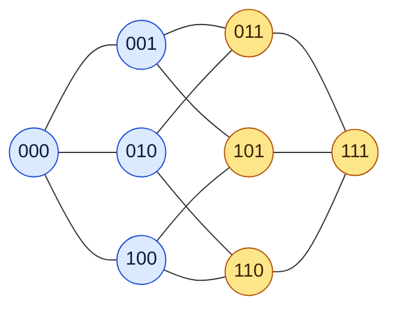
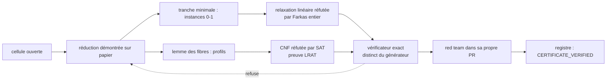
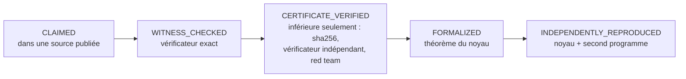

[Português](EXPLICANDO.md) · [English](EXPLAINED.md) · **Français**

# Expliqué : les bornes de Kéri, du profane au docteur

Quatre couches. Chacune est complète en elle-même : arrêtez-vous où vous voulez.
Chaque nombre vient du dépôt ([`ledger/cells.json`](../ledger/cells.json),
[`ledger/COBERTURA.md`](../ledger/COBERTURA.md), [l’article](../paper/main.tex)).
La philosophie qui le porte est dans [PHILOSOPHIE](PHILOSOPHIE.md).

---

## 1. Pour tout le monde · 30 secondes

Imaginez une ville.
Vous devez installer des antennes-relais.
Chaque antenne atteint les maisons proches d’elle.
**Quel est le plus petit nombre d’antennes qui couvre toutes les maisons ?**

Remplacez maintenant les maisons par des mots.
La distance entre deux mots est le nombre de lettres qu’il faut changer pour passer de l’un à l’autre :
`CHAT` et `CHAR` sont à distance 1 ; `CHAT` et `CHER`, à distance 2.

Le nombre `K_q(n,R)` est ce plus petit nombre d’antennes :
des mots de `n` lettres, sur un alphabet de `q` lettres, chaque antenne atteignant jusqu’à `R`
changements.

**D’où cela vient-il ?** Des paris sur le football — en anglais, *football pool*. Le nom figure dans le
titre de l’un des articles classiques du domaine (Hämäläinen et Rankinen, 1991, cité
[dans l’article](../paper/main.tex)).
Chaque match a trois issues : victoire à domicile, nul, victoire à l’extérieur.
Combien de grilles faut-il jouer pour être sûr de se tromper sur au plus un match ?
C’est `K₃(n,1)`, avec `n` matchs.

- Avec 4 matchs : **9 grilles** suffisent, et 8 est impossible.
- Avec 13 matchs : **59 049 grilles**, et cette valeur est exacte.
- Avec 6 matchs : **personne ne sait encore.** Entre 71 et 73.

(Valeurs de `K3(4,1)`, `K3(13,1)` et `K3(6,1)` dans le [registre](../ledger/cells.json).)

---

## 2. Lycée · montrer est facile, prouver que c’est impossible est difficile

### Un petit exemple, résolu à la main

Les mots de 3 bits : `000`, `001`, …, `111`. Il y en a 8. Ce sont les sommets d’un cube, et deux
sommets voisins diffèrent d’exactement un bit.

Avec un rayon 1, chaque mot couvre lui-même et ses 3 voisins : 4 sommets.

- **Un seul mot ne suffit pas.** Il ne couvre que 4 des 8 sommets.
- **Deux suffisent.** `000` couvre le côté bleu ; `111` couvre le côté jaune. Ensemble, tout le cube.

Donc `K₂(3,1) = 2`. C’est fait.

### Borne supérieure et borne inférieure

On ne trouve presque jamais la valeur du premier coup. Ce que l’on a, c’est un intervalle :

    borne inférieure  ≤  K_q(n,R)  ≤  borne supérieure

- **Borne supérieure :** « c’est possible avec `M` ». Elle se prouve en **montrant** un code de `M` mots.
  Vérifier est facile : pour chaque mot de l’espace, trouver un mot du code à distance au plus `R`.
- **Borne inférieure :** « avec moins de `M`, c’est impossible ». Montrer ne sert à rien ici. Il faut
  **écarter toutes les tentatives**, ou trouver un argument qui dispense de les essayer.

Pourquoi la seconde est-elle tellement plus difficile ? Dans `K₃(6,2)`, il y a 729 mots. Vérifier un
code de 17 mots, c’est confronter 729 mots à 17. Mais le nombre de façons de choisir 16 mots parmi 729
dépasse 10³² (calcul direct de `C(729,16)`). Personne ne teste cela un par un. Il faut penser.

C’est l’asymétrie d’une clé : montrer qu’elle ouvre la porte prend une seconde. Prouver qu’aucune clé
plus petite ne l’ouvre oblige à penser à toutes les clés.

---

## 3. Licence · boules de Hamming et un espace qui explose

### La boule et la borne de la sphère

La **boule de Hamming** de rayon `R` autour d’un mot contient

    V_q(n,R) = Σ_{i=0..R} C(n,i) (q−1)^i

mots : choisir `i` positions et remplacer chacune par l’un des `q−1` autres symboles.
Les boules d’un code de `M` mots doivent couvrir les `q^n` mots de l’espace, donc

    K_q(n,R)  ≥  q^n / V_q(n,R)        (borne de la sphère)

Quand l’égalité a lieu, le code est **parfait** : les boules pavent l’espace sans reste. Le cube
ci-dessus en est un cas (8 / 4 = 2). Les paris sur le football aussi : `K₃(4,1) = 9 = 81 / 9` et
`K₃(13,1) = 59 049`, les codes de Hamming ternaires. Presque toujours, pourtant, les boules se
chevauchent, et la borne de la sphère reste loin de la vérité. C’est comme carreler un sol avec des
carreaux ronds.

### Pourquoi le problème explose

L’espace a `q^n` mots : il croît exponentiellement. Pour `K₇(9,4)`, il y en a 40 353 607. Et le nombre
de codes candidats est bien plus grand que l’espace. C’est pourquoi les tables sont pleines
d’intervalles ouverts depuis des décennies.

### Un exemple complet : K₃(6,2) = 17

| qui | quoi | valeur |
|---|---|---|
| calcul | borne de la sphère : 729 / 73, arrondi au-dessus | ≥ 10 |
| Gijswijt–Polak | programmation semi-définie | ≥ 13,12 |
| Blass–Litsyn, 1998 | borne inférieure | ≥ 14 |
| Bertolo–Östergård–Weakley, 2004 | borne inférieure | ≥ 15 |
| Hämäläinen–Rankinen, 1991 | code explicite | ≤ 17 |
| ce dépôt, v0.9 | 15 et 16 sont impossibles | **= 17** |

(Historique et sources dans [NOVIDADE_V09](exatos/NOVIDADE_V09.md) et dans l’[article](../paper/main.tex).)
Pendant 22 ans, de 2004 à aujourd’hui, l’intervalle est resté à 15–17. La nouvelle borne inférieure
est `CERTIFICATE_VERIFIED` : des certificats vérifiés par des programmes exacts hors de Lean, pas un
théorème du noyau.

---

## 4. Master et doctorat

### L’objet

`K_q(n,R)` est le nombre de domination de la puissance `R`-ième du graphe de Hamming `H(n,q)` : le plus
petit ensemble de sommets dont les boules fermées de rayon `R` couvrent `ℤ_q^n`. C’est une instance de
couverture par ensembles (*set cover*) avec `q^n` ensembles et `q^n` éléments. Référence générale :
Cohen, Honkala, Litsyn et Lobstein, *Covering Codes* (1997), cité dans l’[article](../paper/main.tex).

### La littérature

- **Kéri** : les tables de référence, 1145 cellules avec `2 ≤ q ≤ 21`, dernière mise à jour le
  2011-11-25 ([NOVIDADE_V09](exatos/NOVIDADE_V09.md)).
- **Östergård** et ses coauteurs : Bertolo–Östergård–Weakley (2004) et la construction par partition de
  l’alphabet de Kéri–Östergård (2005).
- **Haas, Schlage-Puchta et Quistorff** (2009) : la récursion
  `K_{q+1}(n+1,R+1) ≥ min{2(q+1), K_q(n,R)+1}`.
- **Gijswijt–Polak** (bornes semi-définies), **Marosi** (2026, codes et SDP) et **Florath** (2026, une
  bibliothèque Lean de bornes). Sources figées par commit dans le [registre](../ledger/README.md).

### Les constructions (bornes supérieures)

Des unions de classes latérales d’un code linéaire plus un petit correctif, avec des certificats que le
noyau de Lean vérifie : l’un parcourt les préfixes de chiffres, l’autre travaille sur les syndromes. Le
plus grand saut est `K₇(9,4) ≤ 1134`, contre 1475 publié ([article](../paper/main.tex)).

### Les réductions (bornes inférieures)

**Tranche minimale + programmation linéaire (K₃(6,2)).** Une fibre minimale `F(0,0)` et sa projection
sont normalisées sous forme canonique pour `S_q ≀ S_{n−1}` ; un filtre de comptage écarte les tranches
impossibles. Pour 15 mots, il reste 12 049 instances 0-1 ; pour 16, 12 674. La relaxation linéaire de
chacune est réfutée par des multiplicateurs de Farkas entiers : 12 054 et 13 099 certificats, vérifiés
en arithmétique exacte. Une seconde chaîne sans code commun (autre réduction, autre forme canonique,
preuves VeriPB et LRAT) a reproduit les deux étapes.

**Lemme des fibres + SAT/LRAT (K₇(6,4), K₇(5,3)).** Pour `R = n−2`, une fibre de `s < q` mots force
`K_{q−s}(n−1,R−1) ≤ M−s`. Cela borne la taille des fibres et ramène le problème à des *profils* (le
multi-ensemble des tailles de fibres par coordonnée), chacun codé en CNF et réfuté par CaDiCaL avec une
preuve LRAT vérifiée par `lrat-check`. `K₇(6,4)` : 8 008 profils pour 13 mots. `K₇(5,3)` : un profil
pour 15 et 201 376 profils pour 16, dont deux découpés en 1812 et 4953 cubes.

**Dans le noyau (K₇(4,2) = 19).** Ici, toute la preuve est un théorème de Lean : la réduction, un
vérificateur LRAT écrit pour le noyau avec une preuve de correction, et les réfutations des 70 profils,
en 284 modules et 37,8 heures de CPU ([LEAN_K742](exatos/LEAN_K742.md)).

### L’échelle des états

| côté | CLAIMED | WITNESS_CHECKED | CERTIFICATE_VERIFIED | FORMALIZED | INDEPENDENTLY_REPRODUCED |
|---|---:|---:|---:|---:|---:|
| supérieure | 658 | 0 | 0 | 435 | 52 |
| inférieure | 1140 | 0 | 3 | 2 | 0 |

(Comptes tirés de [`ledger/COBERTURA.md`](../ledger/COBERTURA.md).) A machine-checked ledger of
covering-code upper bounds, with formally certified exact entries. La table entière n’a **pas** été
vérifiée formellement.

### Lacunes ouvertes

- Les bornes inférieures de `K₃(6,2)`, `K₇(6,4)` et `K₇(5,3)` reposent sur des réductions démontrées
  sur papier ; ce ne sont pas des théorèmes du noyau.
- `K₇(6,4)` et `K₇(5,3)` n’ont pas été reproduites intégralement de façon indépendante : le codage
  indépendant a couvert 16 des 8 008 profils et 8 profils bon marché, respectivement
  ([article](../paper/main.tex)).
- `K₇(5,3) ≤ 17` n’est qu’annoncée dans les tables de Kéri et reste `CLAIMED`.
- Là où les mêmes méthodes s’arrêtent : `K₃(7,3)` (11–12) et des cellules binaires plus grandes,
  consignés dans la section « Where the same methods stop » de l’[article](../paper/main.tex). Et le pari
  à 6 matchs, `K₃(6,1)`, reste à 71–73.
