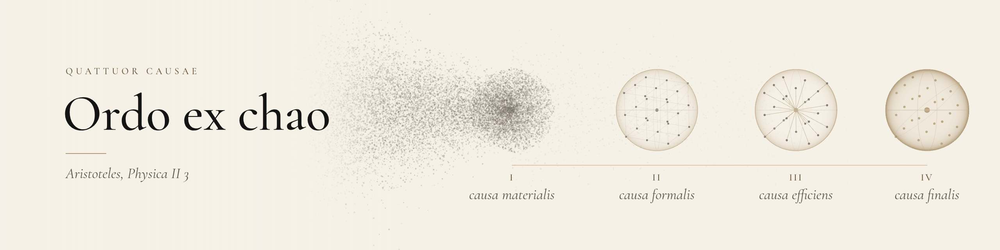
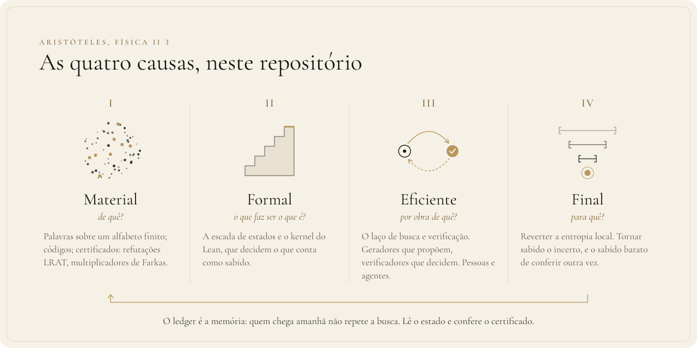

<div align="center">

**Português** · [English](PHILOSOPHY.md) · [Français](PHILOSOPHIE.md)

<picture>
  <source media="(prefers-color-scheme: dark)" srcset="assets/filosofia-escuro.png">
  <source media="(prefers-color-scheme: light)" srcset="assets/filosofia-claro.png">
  
</picture>

# Filosofia

**Do caos à ordem: o que fazemos, por que fazemos e com que regra decidimos o que é verdade.**

</div>

> *"INSUFFICIENT DATA FOR MEANINGFUL ANSWER."*
>
> — Isaac Asimov, *A Última Pergunta*[^asimov]

Este texto segue a ordem de Aristóteles[^aristoteles].
Definições, princípios, proposições, método, causas.

Toda afirmação de fato aponta para o arquivo que a sustenta.
O que não aponta é convicção, e está escrito como tal.

<p align="center">
<a href="#i-definições">Definições</a> ·
<a href="#ii-princípios">Princípios</a> ·
<a href="#iii-proposições">Proposições</a> ·
<a href="#iv-método">Método</a> ·
<a href="#v-as-quatro-causas">Quatro causas</a> ·
<a href="#vi-o-teorema-do-james">James</a> ·
<a href="#vii-o-que-ainda-nos-escapa">Horizonte</a> ·
<a href="#viii-lacunas-declaradas">Lacunas</a>
</p>

---

## I. Definições

**1. Célula.** Um número `K_q(n,R)`: o menor código de comprimento `n`, sobre `q` símbolos, que deixa
toda palavra a distância de Hamming no máximo `R` de alguma palavra do código
([paper, Introdução](../paper/main.tex)).

```math
K_q(n,R) \;=\; \min\bigl\lbrace\,|C| \;:\; C \subseteq \mathbb{Z}_q^n,\ \ \forall x \in \mathbb{Z}_q^n\ \ \exists c \in C,\ \ d_H(x,c) \le R \,\bigr\rbrace
```

As tabelas de Kéri guardam 1145 células, com `q` de 2 a 21 ([ledger](../ledger/README.md)).

**2. Cota.** Um intervalo.

```math
\text{inferior} \;\le\; K_q(n,R) \;\le\; \text{superior}
```

A superior se prova mostrando um código.
A inferior, provando que nenhum código menor existe.

**3. Entropia local.** A dúvida que resta sobre uma célula.
A distância entre as duas cotas, e a incerteza sobre cada uma.
Local, porque é de um problema, não do universo.

**4. Colapso de estado.** O instante em que o intervalo vira ponto.
Antes, muitas respostas possíveis. Depois, uma só.

**5. Estado de certificação.** O grau de confiança em cada cota, numa escada que só sobe:
`CLAIMED`, `WITNESS_CHECKED`, `CERTIFICATE_VERIFIED` (só inferior), `FORMALIZED`,
`INDEPENDENTLY_REPRODUCED` ([ledger, Certificação](../ledger/README.md)).

---

## II. Princípios

> Quem propõe pode errar à vontade. Quem decide precisa ser barato e exato.

**1. Verificar é mais barato que achar.**
Achar um código é busca num espaço imenso. Conferir um código dado é uma conta finita.
É a assimetria que a pergunta P vs NP formaliza.
Para nós, é norte de engenharia, não teorema.

**2. A descoberta cara vira verificação barata.**
A busca que dá certo deixa um certificado: um código explícito, uma refutação LRAT, multiplicadores
de Farkas inteiros, um teorema do kernel ([paper, Introdução](../paper/main.tex)).
Quem vem depois não repete a busca. Confere.

**3. O avaliador decide.**
O centro deste repositório não é o solver. É o verificador:
[`tools/verify/verify.c`](../tools/verify/verify.c) e o kernel do Lean.

**4. O medido vence o lido.**
Cota da literatura entra como `CLAIMED`. Só sobe quando algo aqui a confere.
O estado é calculado por script, nunca escrito à mão ([`ledger/build.py`](../ledger/build.py)).

**5. O erro é medida, não dívida.**
Onde uma prova quebra, faltava uma regra.
Por isso publicamos o que falhou ([paper, "Where the same methods stop"](../paper/main.tex)).
Por isso cada cota inferior nova enfrenta um red team antes de entrar
([K₇(5,3)](exatos/REDTEAM_K753.md), [K₇(6,4)](exatos/REDTEAM_K764.md),
[K₃(6,2)](exatos/k362/K3_M16_REDTEAM.md)).

**6. Não dizer mais do que se provou.**
A frase do ledger é fixa:

> *A machine-checked ledger of covering-code upper bounds, with formally certified exact entries.*

A tabela inteira não foi verificada formalmente.
As cotas inferiores são, quase todas, herdadas da literatura ([cobertura](../ledger/COBERTURA.md)).

---

## III. Proposições

<p align="center">
  
</p>

| proposição | evidência |
|---|---|
| **547 das 1145 cotas superiores** estão em `FORMALIZED` ou `INDEPENDENTLY_REPRODUCED`. Das inferiores, 3 estão em `CERTIFICATE_VERIFIED` e 2 em `FORMALIZED`. | [`ledger/COBERTURA.md`](../ledger/COBERTURA.md) |
| **Duas células exatas com as duas cotas no kernel:** `K₂(6,1) = 12` e `K₇(4,2) = 19`. | [paper, "A certified ledger"](../paper/main.tex) · [LEAN_K742](exatos/LEAN_K742.md) |
| **Três colapsos potencialmente novos**, não encontrados na literatura que pesquisamos: `K₃(6,2) = 17`, `K₇(6,4) = 14`, `K₇(5,3) = 17`. As três cotas inferiores são `CERTIFICATE_VERIFIED`, não teoremas do kernel. | [NOVIDADE_V09](exatos/NOVIDADE_V09.md) · [ledger](../ledger/README.md) |

---

## IV. Método

<p align="center">
  
</p>

> O ciclo só termina quando algo mudou de estado e foi conferido.

1. **Escolher** uma célula pela dúvida que guarda.
2. **Buscar.** A parte cara: construções, SAT, programação linear, red team.
3. **Certificar.** Reduzir a descoberta a um objeto que um verificador exato confere.
4. **Registrar** no ledger, com fonte, sha256 e estado calculado ([`ledger/cells.json`](../ledger/cells.json)).
5. **Expor.** Paper, DOI, lacunas declaradas. Para que outro refaça sem confiar em nós.

O ledger é a memória.<br>
Quem chega amanhã não repete a busca.<br>
Lê o estado, e confere o certificado.

---

## V. As quatro causas

<p align="center">
  
</p>

| causa | a pergunta de Aristóteles | aqui |
|---|---|---|
| **Material** | de quê? | Palavras sobre um alfabeto finito; códigos; certificados ([um código](../data/codes/q7_n6_R4_M14.txt), refutações LRAT, multiplicadores de Farkas). |
| **Formal** | o que faz ser o que é? | A escada de estados e o kernel do Lean, que decidem o que conta como sabido. |
| **Eficiente** | por obra de quê? | O laço de busca e verificação. Geradores que propõem, verificadores que decidem. Pessoas e agentes. |
| **Final** | para quê? | Reverter a entropia local. Tornar sabido o incerto. E tornar o sabido barato de conferir outra vez, para sempre. |

---

## VI. O teorema do James

O repositório [thiagopatzdorf/james-theorems](https://github.com/thiagopatzdorf/james-theorems) prova
em Lean 4, sem Mathlib e sem `sorry`, três propriedades de **modelos** simples da filosofia que guia
este trabalho
([README](https://github.com/thiagopatzdorf/james-theorems/blob/12616cf56ed737a2cdfb9034753d5679c8091b49/README.md)).

**Conhecimento** (`amortizacao`).
Numa fila de $N$ tarefas, $D$ delas distintas, partindo de base vazia: exatamente $D$ buscas e
$N$ verificações.

```math
\text{custo} \;=\; D \cdot \text{busca} \;+\; N \cdot \text{verificação}
```

([Conhecimento.lean](https://github.com/thiagopatzdorf/james-theorems/blob/12616cf56ed737a2cdfb9034753d5679c8091b49/JamesTheorems/Conhecimento.lean)).
Que o custo por tarefa tenda ao de verificar quando $D$ cresce mais devagar que $N$ é leitura do
autor, não parte do enunciado.

**Segurança** (`gate`).
Para qualquer log, mesmo adversário, nenhuma ação crítica aparece executada sem aprovação registrada
([Seguranca.lean](https://github.com/thiagopatzdorf/james-theorems/blob/12616cf56ed737a2cdfb9034753d5679c8091b49/JamesTheorems/Seguranca.lean)).

**Alma** (`replay`, `retomada`, `revezamento`).
O estado é a dobra de uma transição pura sobre o log.
Dois corpos com a mesma transição chegam ao mesmo estado.
Um corpo pode parar em qualquer evento, e outro retoma do snapshot.
O log pode ser dividido entre corpos
([Alma.lean](https://github.com/thiagopatzdorf/james-theorems/blob/12616cf56ed737a2cdfb9034753d5679c8091b49/JamesTheorems/Alma.lean)).

> A fronteira, nas palavras do próprio repositório: os teoremas valem para os modelos, não para o código de produção.

São provas curtas sobre estruturas simples.
Não resolvem um problema difícil. Tornam exata a forma de um argumento.

Aqui, essa forma encontra um problema real: o ledger é o log, o certificado é a verificação barata,
e a busca cara acontece uma vez por célula.

---

## VII. O que ainda nos escapa

Os sete Problemas do Milênio do Clay Mathematics Institute são horizonte, não alvo.
Não atacamos nenhum deles.

Um deles, **P vs NP**, pergunta se tudo o que se confere depressa também se acha depressa.
É a assimetria sobre a qual este trabalho inteiro se apoia, e ninguém sabe se ela é real.

A conjectura de Poincaré foi resolvida por Perelman, em preprints de 2002 e 2003.
O prêmio foi concedido em 2010, e ele o recusou. Os outros seis seguem abertos[^clay].

---

## VIII. Lacunas declaradas

- As cotas inferiores de `K₃(6,2)`, `K₇(6,4)` e `K₇(5,3)` não são teoremas do kernel. Dependem de uma
  redução provada no papel e de certificados conferidos fora do Lean ([paper](../paper/main.tex)).
- A cota superior `K₇(5,3) ≤ 17` ganhou código próprio de 17 palavras e teorema Lean (`CoveringK753.K_7_5_3_le_17`); a lacuna que resta é a inferior, fora do Lean.
- "Potencialmente novo" quer dizer não encontrado nas fontes listadas. Textos fechados de 2004 a 2009
  não foram lidos ([NOVIDADE_V09](exatos/NOVIDADE_V09.md)).
- Literatura posterior a 2011 fora das fontes do ledger não foi auditada ([ledger](../ledger/README.md)).

Para quem quer o problema explicado do zero: [Explicando](EXPLICANDO.md).

---

<p align="center"><em>Haja luz. Mas só onde houver certificado.</em></p>

[^asimov]: Isaac Asimov, "The Last Question" (*A Última Pergunta*), *Science Fiction Quarterly*, novembro de 1956.
[^aristoteles]: Aristóteles, *Física* II 3 e *Metafísica* Δ 2: as quatro causas, ou as quatro maneiras de responder "por quê?".
[^clay]: [claymath.org/millennium-problems](https://www.claymath.org/millennium-problems/); [conjectura de Poincaré](https://www.claymath.org/millennium/poincare-conjecture/); [a recusa](https://www.claymath.org/news/poincare-chair-2/).
